# Mục lục

1. [Struct](#struct)
2. [Enum](#enum)
3. [Union](#union)
4. [Bit field](#bit_fields)

# <a id = "struct"></a> Struct

- Struct là 1 kiểu dữ liệu tự định nghĩa bao gồm nhiều thành phần có thể thuộc nhiều kiểu dữ liệu khác nhau.
  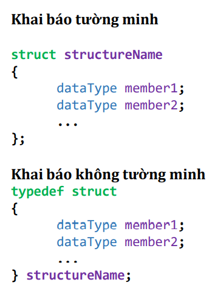
- Kích thước của struct bằng bội của phần tử có kích thước lớn nhất trong struct đó.
  **Ví dụ 1**

  ```
  struct info{
    int age;
    char name[10];
  }
  ```

Ở **Ví dụ 1** trên, int là kiểu dữ liệu 4 bytes (lớn nhất trong struct info) nên kích thước là bội của 4.
Vì kiểu struct sẽ cấp phát theo từng block, mỗi block có kích thước = 4 bytes, vì thế nó sẽ cấp phát 4 byte cho 'age', tiếp theo là 4 byte cho 'char' (vì ở block đầu tiên 'age' đã chiếm hết 4 byte) => nên kích thước của struct này là 8 bytes.
Nếu khai báo kiểu 'char' trước thì kích thước struct vẫn vậy.

```
struct info{
  char name[10];
  int age;
}
```

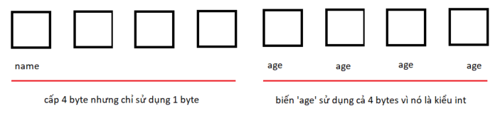

**Ví dụ 2**

```c
struct info{
  char id;
  int age;
  double gpa;
}
```

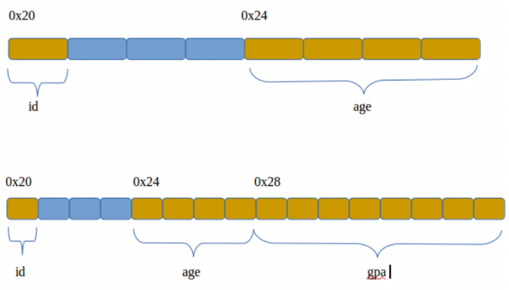

- Khi sử dụng struct ta thường gặp phải trường hợp **Phân mảnh bộ nhớ**

Để khắc phục vấn đề này, ta sử dụng _#pragma pack(n)_, từ khóa này giúp trình biên dịch hiểu rằng cấp phát cho các phần tử trong struct theo từng _n bytes_
**Ví dụ 3**
Nếu ko sử dụng từ khóa _#pragma pack(n)_ thì struct sẽ tốn nhiều dung lượng hơn.

```c
struct info{
  char a;
  int b;
  char c;
}
```

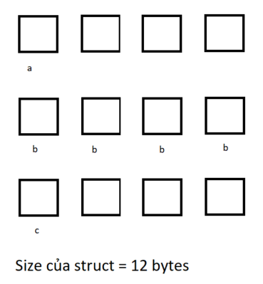

```c
#pragma pack(1)
struct info{
  char a;
  int b;
  char c;
}
#pragma pack() //end pragma
```

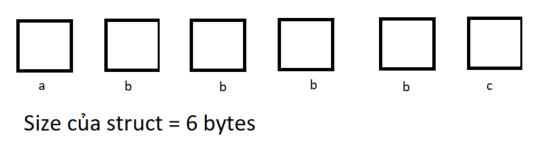

# <a id = "enum"></a>Enum

Enum là 1 kiểu dữ liệu người dùng tự định nghĩa, được sử dụng để gán tên cho các hằng số. Tác dụng của chúng giúp lập trình viên không nhầm lẫn và dễ kiểu soát khi làm việc với nhiều hằng số.

- Có 2 kiểu khai báo cho Enum:
  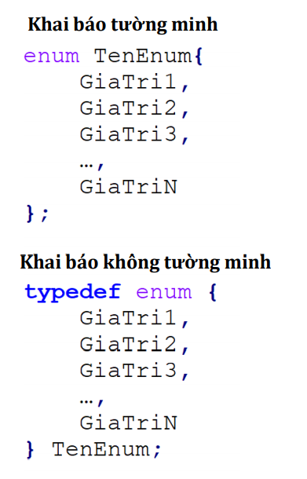
- Nếu không gán giá trị cho các hằng số trong enum thì nó mặc định bắt đầu từ giá trị 0
- Nếu đã gán 1 giá trị bất kỳ trong enum, các giá trị sau thì cộng thêm 1 đơn vị nhưng các giá trị đứng trước sẽ được gán giá trị theo index đầu tiên (được gán = 0 nếu chưa đc gán giá trị nào).

# <a id = "union"></a>Union

Union là 1 kiểu dữ liệu trong C, cho phép lưu trữ các biến có các kiểu dữ liệu khác nhau trong cùng một vùng nhớ. Có thể định nghĩa Union với rất nhiều tham số, nhưng chỉ 1 thành phần chứa giá trị tại 1 thời điểm.

- Union sẽ cùng lưu trữ giá trị của các biến tại cùng một ô nhớ
  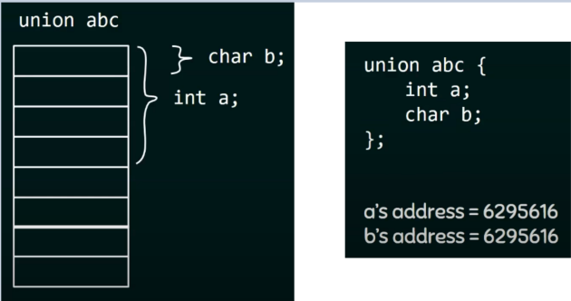
- Có 2 kiểu khai báo đối với Union (giống với struct)
  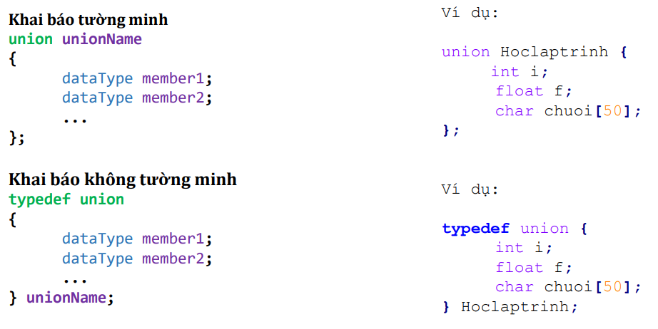
- Kích thước của Union chính bằng kích thước kiểu dữ liệu có kích thước lớn nhất.
  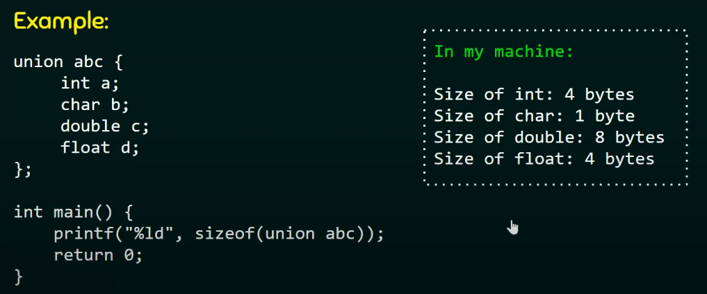
- Từ đó, dễ dàng thấy được sự khác biệt giữa _struct_ và _union_
  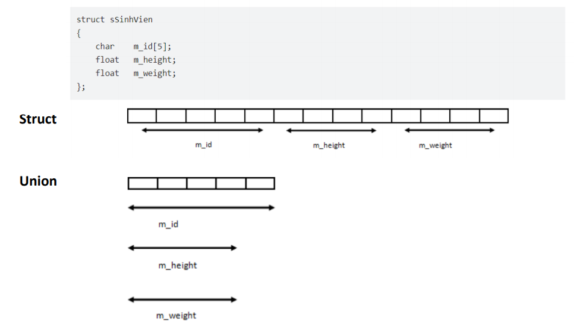

# <a id = "bit_fields"></a>Bit fields

**Bit fields** là 1 kỹ thuật nhằm tối ưu bộ nhớ trong struct, trong 1 số trường hợp khi ta sử dụng kiểu dữ liệu có phạm vi lớn nhưng thực tế kích thước nhỏ hơn hoặc bao giờ đạt đến những giá trị lớn đó.
**Ví dụ**: khi khai báo 1 biến có kiểu 'bool' (chỉ có 2 giá trị true & false) tuy nhiên lại sử dụng mất 1 byte (8 bit) cho kiểu dữ liệu này, trong khi chỉ cần sử dụng 1 bit (0 hoặc 1) để biểu diễn giá trị cho kiểu dữ liệu 'bool', từ đấy nhận thấy chúng ta lãng phí 7 bit.

**Cách thức cấp phát:** Bit fields sẽ cấp phát lần lượt, nó sẽ tìm kiểu dữ liệu có kích thước lớn nhất trong 1 'data structure' (ví dụ: int 4 bytes).
Nếu có nhiều kiểu dữ liệu thì mỗi kiểu dữ liệu sẽ được cấp phát 1 lần với kích thước của kiểu dữ liệu lớn nhất.

- 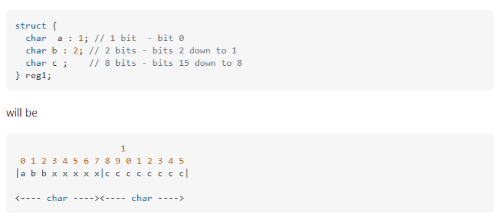
- 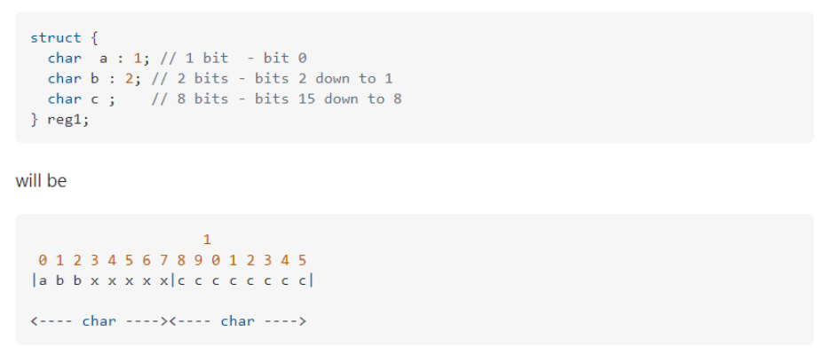
