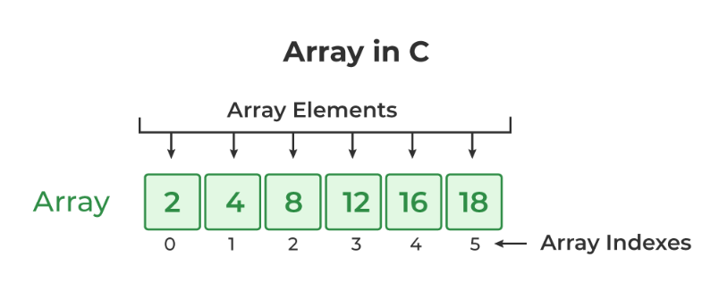
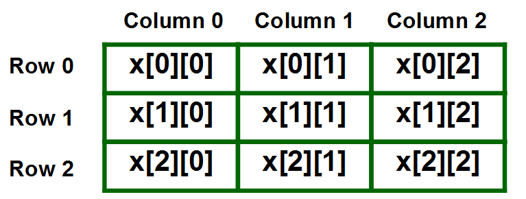

```
Author: du.pham
```
# DAY 2: ARRAY-POINTER-STRING

## 1. ARRAY
**Định nghĩa**
```
- Mảng là một trong những cấu trúc dữ liệu được sử dụng nhiều nhất trong C.
- Mảng là một tập hợp các phần tử cố định có cùng kiểu dữ liệu, được lưu trữ liền kề 
trong bộ nhớ.
- VD: Tập hợp các số nguyên dương, bảng chữ cái,... thì đều được coi là một mảng.
```

**Syntax**
```
data_type array_name[size]; // mảng 1 chiều 
or
data_type array_name[size1][size2]...[sizeN] // mảng nhiều chiều
```
**Đặc điểm cơ bản về mảng**
```
- Mảng luôn là một tập hợp có kích thước cố định.
- Là một tập hợp đồng nhất về kiểu dữ liệu.
- Chỉ số của mảng luôn là số nguyên dương và bắt đầu từ giá trị 0.
- Các ô nhớ trong một mảng có vị trí liền kề nhau trong bộ nhớ.
- Các phần tử trong mảng có thể được truy cập ngẫu nhiên thông qua chỉ số của nó trong mảng.
```

**Example**
```c
//Ví dụ về việc khai báo một mảng
#include <stdio.h>
 
int main()
{
 
    int arr_int[5]; // Khai báo mảng gồm 5 phần tử là các số nguyên

    char arr_char[5]; // khai báo mảng gồm 5 phần tử là các kí tự
 
    return 0;
}
```

```c
//Ví dụ về việc khởi tạo các giá trị cho mảng
#include <stdio.h>
 
int main()
{
 
    int arr[5] = { 10, 20, 30, 40, 50 };// khởi tạo các giá trị của mảng với kích thước mảng là 5
    
    
    int arr1[] = { 1, 2, 3, 4, 5 }; // mảng chưa được khởi tạo về kích thước
 
    int arr2[5];
    for (int i = 0; i < 5; i++) { // khởi tạo mảng sử dụng vòng for
        arr2[i] = i;
    }
    int arr3[5] = {1, 2, 3}; // có thể khởi tạo như thế này=> arr3[5] = {1,2,3,0,0};
    return 0;
}
```

```c
#include <stdio.h>//Ví dụ về mảng các kí tự
 
int main()
{
 
    char arr[5] = {'h', 'e', 'l', 'l', 'o'};
 
    printf("Element at arr[2]: %c\n", arr[2]);
 
    printf("Element at arr[4]: %c\n", arr[4]);
 
    printf("Element at arr[0]: %c", arr[0]);

    arr[0] = 'm';

    printf("Element at arr[0] after change value: %c", arr[0]);
 
    return 0;
}
```
**Output**
```
Element at arr[2]: l
Element at arr[4]: o
Element at arr[0]: h
Element at arr[0] after change value: m
```
```c
//Truy cập vào các phần tử trong mảng và thay đổi giá trị phần tử
#include <stdio.h>
 
int main()
{
 
    // array declaration and initialization
    int arr[5] = { 15, 25, 35, 45, 55 };
 
    // accessing element at index 2 i.e 3rd element
    printf("Element at arr[2]: %d\n", arr[2]);
 
    // accessing element at index 4 i.e last element
    printf("Element at arr[4]: %d\n", arr[4]);
 
    // accessing element at index 0 i.e first element
    printf("Element at arr[0]: %d", arr[0]);

    arr[0] = 20;

    printf("Element at arr[0] after change value: %d", arr[0]);
 
    return 0;
}
```
**Output**
```
Phan tu tai arr[2]: 35
Phan tu tai arr[4]: 55
Phan tu tai arr[0]: 15
Phan tu tai arr[0] sau khi thay đổi giá trị: 20
```
## Con trỏ mảng
**Định nghĩa**
```
Là một biến con trỏ lưu trữ địa chỉ đầu tiên của mảng, nó cũng là địa chỉ tại vị trí phần tử đầu tiên của mảng
```
**Example**
```c
#include <stdio.h>
 
int main()
{
 
    int a[5] = {1,2,3,4,5};
    printf("%#x", a);// địa chỉ đầu tiên của mảng
    printf("%#x", &a[0]);// địa chỉ phần tử đầu tiên trong mảng
    return 0;
}
```
**Output**
```
0x61ff0c
0x61ff0c
```
```c
#include <stdio.h>
 
int main()
{
 
    int a[5] = {1,2,3,4,5};
    int *ptr = a;// sử dụng 1 con trỏ khác để quản lý mảng a
    for(int i = 0; i < 5; i++){
        printf("%d ", *(ptr+i));//in ra các giá trị trong mảng
    }
    return 0;
}
```
**Output**
```
1 2 3 4 5 
```
## Mảng nhiều chiều
**Định nghĩa**
```
Là một mảng của các mảng, cái mà lưu trữ dữ liệu đồng nhất trên 1 dạng bảng.
Dữ liệu trong mảng nhiều chiều thì thường được lưu trữ theo thứ tự hàng trên bộ nhớ.
```

**Syntax**
```
data_type array_name[size1][size2]...[sizeN]
```
**Example**
```c
#include <stdio.h>
 
int main()
{
 
    int a[2][2] = {1,2,3,4};//Khai báo ma trận a với kích thước 2x2
    int b[3][4];//Khai báo ma trận b với kích thước 3 x 4
    for(int i = 0; i < 3; i++){
        for(int j = 0; j < 4; j++){
            b[i][j] = 100;
        }
    }
    for(int i = 0; i < 2; i++){
        for(int j = 0; j < 2; j++){
            printf("%d ", a[i][j]);
        }
        printf("\n");
    }
    for(int i = 0; i < 3; i++){
        for(int j = 0; j < 4; j++){
            printf("%d ", b[i][j]);
        }
        printf("\n");
    }
    
    return 0;
}
```
**Output**
```
1 2 
3 4
100 100 100 100
100 100 100 100
100 100 100 100
```
# 2. STRING

**Định nghĩa**
```
Là một tập hợp các kí tự được kết thúc bằng kí tự null '\0'.
Sực khác nhau giữa mảng kí tự và chuối trong C là chuỗi trong C được kết thúc bằng kí tự '\0'.
```
**Example**
```c
#include <stdio.h>
 
int main()
{
 
    // array declaration and initialization
    char arr[6] = {'h', 'e', 'l', 'l', 'o', '\0'};
    char arr1[] = "Hello world";
	printf("%s\n", arr);
    printf("%s", arr1);
    return 0;
}
```
**Output**
```
hello
Hello world
```
**Một số cách khai báo String trong C**


```c
#include <stdio.h>
 
int main()
{
 
    //Sử dụng khai báo như mảng thông thường;
    char arr[6] = {'h', 'e', 'l', 'l', 'o', '\0'};
    char arr1[] = "Hello world";
    //Sử dụng con trỏ;
    char *myString = "Pham Van Du";
    const char *myString1 = "Pham Van Du";
	printf("%s\n", arr);
    printf("%s\n", arr1);
    printf("%s\n", myString);
    printf("%s\n", myString1);
    return 0;
}
```
**Output**
```
hello
Hello world
Pham Van Du
Pham Van Du
```
## Sự khác biệt về kiểu khai báo trong string
**Khai báo theo dạng mảng thông thường**
```
Khi ta khai báo string theo dạng mảng thông thường,
lúc này dữ liệu của ta sẽ được lưu trữ trên RAM, 
do đó mà chúng ta có thể thay đổi được string hoặc thay đổi 1 kí tự trong string.
```
**Example**
```c
#include <stdio.h>
 
int main()
{
 
    //Sử dụng khai báo như mảng thông thường;
    char arr[6] = {'h', 'e', 'l', 'l', 'o', '\0'};
    char arr1[] = "Hello world";
    arr[0] = 'H';
    arr1[0] = 'h';
	printf("%s\n", arr);
    printf("%s\n", arr1);
    return 0;
}
```
**Output**
```
Hello
hello world
```
**Khai báo dạng con trỏ**
```
Khi ta khai báo string theo dạng mảng thông thường, lúc này dữ liệu của ta sẽ được lưu trữ trên ROM, do đó mà chúng ta không thể thay đổi 1 kí tự trong string.
```
```c
#include <stdio.h>
 
int main()
{
 
    //Sử dụng con trỏ;
    char *myString = "Pham Van Du";
    const char *myString1 = "Pham Van Du";
    printf("%s\n", myString);
    printf("%s\n", myString1);

    myString[0] = 'E';
    myString1[0] = 'D';
    return 0;
}
```
**Ouput**
```
main.c: In function 'main':
main.c:10:18: error: assignment of read-only location '*myString1'
     myString1[0] = 'D';
                  ^
```