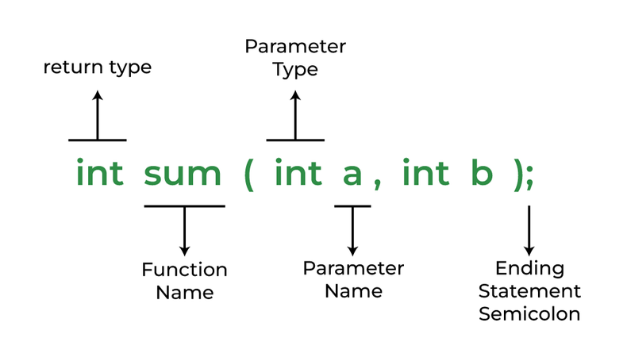
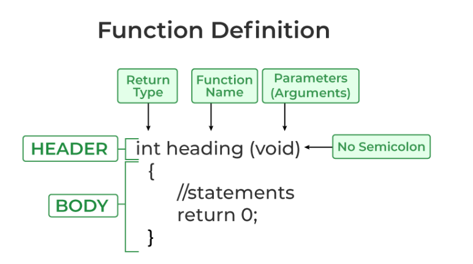
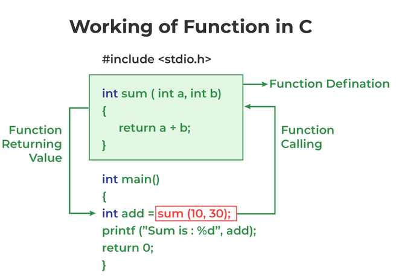

```
Author: du.pham-10/11/2023
```

# Mục lục

- [Function](#function-in-c)
  - [Khai báo hàm](#khai-báo-hàm)
  - [Định nghĩa hàm](#định-nghĩa-hàm)
  - [Gọi hàm](#gọi-hàm)
  - [Ví dụ về hàm trong C](#ví-dụ-về-hàm-trong-c)
  - [Truyền tham vào cho hàm](#truyền-tham-vào-cho-hàm)
    - [Truyền tham trị](#truyền-tham-trị)
    - [Truyền tham chiếu](#truyền-tham-chiếu)

# Function

**Định nghĩa**

- Hàm trong C là một tập hợp các câu lệnh cái mà khi được gọi sẽ thực thị một nhiệm vụ cụ thể nào đó.
- Nó là một khối cơ bản của chương trình C, dễ dùng và có thể tái sử dụng.

**Syntax**

- Cú pháp của hàm có thể được chia làm 3 khía cạnh
  - Khai báo hàm
  - Định nghĩa hàm
  - Gọi hàm

## Khai báo hàm

**Syntax**

return_type **name_of_the_function**(parameter1, parameter2,...)

**Example**

```
int sum(int a, int b);
int sum(int, int);
```



**Note**

```
Một hàm trong C phải được khai báo ở phạm vi global trước khi gọi.
```

## Định nghĩa hàm

Định nghĩa hàm sẽ bao gồm các câu lệnh sẽ được thực thi khi mà hàm được gọi đến. Hay nói cách khác thì định nghĩa hàm sẽ là phần thân của hàm.

**Syntax**

return_type **function_name**(para1, para2){
//body of the function
}



## Gọi hàm

Gọi hàm là một câu lệnh mà thông báo tới trình biên dịch thực thi hàm mà chúng ta thực hiện. Chúng ta sẽ sử dụng tên hàm và các tham số trong hàm để thực hiện việc gọi hàm.



## Ví dụ về hàm trong C

```c
#include <stdio.h>

 //Hàm có chức năng tính tổng 2 số nguyên
int sum(int a, int b)
{
  return a + b;
}

int main()
{
  int add = sum(10, 30);// thực thi việc gọi lại hàm

  printf("Tong la: %d", add);
  return 0;
}
```

**Kiểu trả về của hàm**

Là kiểu dữ liệu mà chúng ta mong muốn nhận về khi một hàm được thực thi. Kiểu dữ liệu trả về có thể là int, char,...

**Example**

```
int func(parameter_1,parameter_2);
```

Ở ví dụ phía trên, hàm có tên là **func** gồm 2 tham số đầu vào có kiểu dữ liệu trả về là **int**.

**Note**: Sẽ có nhiều trường hợp mà hàm không cần kiểu dữ liệu trả về.

**Tham số của hàm**

Là dữ liệu cần được truyền vào trong một hàm để thực thi.

**Example**

```
int function_name(int var1, int var2);
```

Ở ví dụ trên, hàm nhận tham số đầu vào là 2 giá trị số nguyên, do đó khi thực hiện việc gọi hàm thì chúng ta cần truyền vào hàm 2 số nguyên để hàm có thể thực thi đúng.

**Note**: Sẽ có nhiều trường hợp mà hàm sẽ không nhận tham số đầu vào.

## Truyền tham vào cho hàm

Việc truyền tham số vào cho hàm thường sẽ có 2 cách: truyền tham chiếu và truyền tham trị.

### Truyền tham trị

**Định nghĩa truyền tham trị**

- Là một phương thức truyền đối số cho một hàm bằng cách sao chép giá trị của đối số gốc vào một biến mới trong hàm. Khi giá trị của biến trong hàm được thay đổi, giá trị của biến gốc không bị ảnh hưởng.

- Khi một hàm được gọi và truyền đối số bằng tham trị, một bản sao của giá trị đối số được tạo ra và được gán cho biến trong hàm. Bất kỳ thay đổi nào được thực hiện trên biến trong hàm không ảnh hưởng đến giá trị của biến gốc bên ngoài hàm.
- **Example**

```c
#include <stdio.h>

void swap(int a, int b)
{
  int temp = a;
  a = b;
  b = temp;
}

int main()
{
  int a = 3, b = 2;
  printf("Gia tri cua a va b truoc khi doi: %d, %d\n",a, b);
  swap(a, b);
  printf("Gia tri cua a va b sau khi doi: %d, %d",a, b);
  return 0;
}
```

**Ouptut**

```
Gia tri cua a va b truoc khi doi:3, 2
Gia tri cua a va b sau khi doi:3, 2
```

**Nhận xét**: Có thể thấy, sau khi thực thi hàm swap, thì hai giá trị của a và b vẫn giữ nguyên giá trị như ban đầu mà không có sự thay đổi gì theo như mong muốn của chúng ta.

### Truyền tham chiếu

**Định nghĩa truyền tham chiếu**

- Là một phương thức truyền đối số cho một hàm bằng cách truyền địa chỉ của biến gốc vào một tham số con trỏ trong hàm. Khi giá trị của biến trong hàm được thay đổi thông qua con trỏ, giá trị của biến gốc cũng bị ảnh hưởng.

- Khi một hàm được gọi và truyền đối số bằng tham chiếu, địa chỉ của biến gốc được truyền vào hàm thông qua một tham số con trỏ. Bất kỳ thay đổi nào được thực hiện trên biến thông qua con trỏ trong hàm cũng ảnh hưởng đến giá trị của biến gốc bên ngoài hàm.

**Example**

```c
#include <stdio.h>

void swap(int *a, int *b)
{
  int temp = *a;
  *a = *b;
  *b = temp;
}

// Driver code
int main()
{
  int a = 3, b = 2;
  printf("Gia tri cua a va b truoc khi doi: %d, %d\n",a, b);
  swap(&a, &b);
  printf("Gia tri cua a va b sau khi doi: %d, %d",a, b);
  return 0;
}
```

**Output**

```
Gia tri cua a va b truoc khi doi:3, 2
Gia tri cua a va b sau khi doi:2, 3
```

**Nhận xét**

Sau khi thực hiện việc truyền tham chiếu, thì giá trị a và b đã được đổi chỗ cho nhau và đã đạt được đúng mong muốn như chúng ta đề ra
