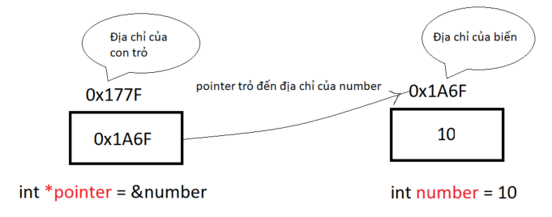
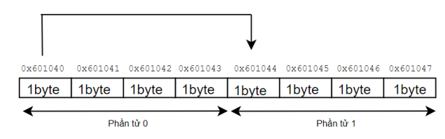
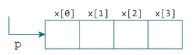

```
Author: Lê Minh Đức (duc5.le)
Study time: 7/11/2023 - 8/11/2023
```

# Con trỏ cấp 1 (Pointer)

### Lý thuyết

Con trỏ trong C cũng là 1 biến bình thường, khác 1 chỗ là nó sẽ lưu trữ địa chỉ của 1 biến khác, tức là giá trị của chúng là 1 địa chỉ trong RAM.


- Khai báo con trỏ
  `<kiểu dữ liệu> * <tên biến>`
- Kiểu con trỏ cần giống với kiểu biến mà nó trỏ tới
- Khi áp dụng toán tử tăng/giảm với con trỏ: nó sẽ di chuyển giữa các phẩn tử liền kề chứ không tăng giảm giá trị như biến thông thường.
  **Ví dụ**

        #include "stdio.h"
        int number = 10;
        int main(){
            int *p = &number;
            printf("Địa chỉ hiện tại của p: %p\n", p);
            p = p + 1;
            printf("Địa chỉ mới của p: %p", p);
            return 0;
        }

  

- Mối quan hệ giữa _con trỏ_ và _mảng_
  Ta khai báo 1 con trỏ và 1 mảng 4 phần tử như sau:
  ```
    int x[4];
    int *p;
    p = x;
    // gán con trỏ p trỏ đến địa chỉ của phần tử đầu tiên của mảng
    // hoặc có thể gán như sau p = &x[0], 2 cách gán này như nhau.
  ```
  
  Với mảng trong ảnh phía trên, ta có:
  ```
  &x[0] và p có cùng giá trị, và x[0] hay _p hay p[0] là tương đương nhau.
  &x[1] tương đương với p+1 và x[1] tương đương với _(p+1) và p[1].
  &x[2] tương đương với p+2 và x[2] tương đương với _(p+2) và p[2].
  ```
  Tóm lại, **&x[i]** tương đương với **p+i** và **x[i]** tương đương với **\_(p+i)** và **p[i]**.

# Con trỏ cấp 2 (Pointer to pointer)

### Lý thuyết

- Con trỏ cấp 2 là 1 con trỏ dùng để lưu trữ địa chỉ của 1 biến con trỏ khác
  

Bản chất con trỏ cấp 2 cũng chỉ là con trỏ, chúng ta vẫn xuất được 3 giá trị liên quan tới con trỏ cấp 2 (giống như con trỏ cấp 1).

```
**ptr: giá trị mà ptr trỏ đến
*ptr: địa chỉ của con trỏ mà ptr trỏ tới
ptr: địa chỉ của **ptr
```

### Coding

- **Ví dụ 1:** tổng quát về con trỏ cấp 2

```
#include "stdio.h"

int main() {
    int number = 100;
    int *ptr = &number;
    int **p_to_p = &ptr;

    printf("value of number = %d\n", number);
    printf("address of number = %p\n", &number);  // %p: hexadecimal
    printf("*\n");
    printf("value of ptr: %d\n", *ptr);
    printf("address of ptr: %p\n", &ptr);
    printf("address of number: %p\n", ptr);
    printf("*\n");
    printf("value of p_to_p: %d\n", **p_to_p);
    printf("address of p_to_p: %p\n", p_to_p);
    printf("address of ptr: %p\n", *p_to_p);  // the address that p_to_p points
    return 0;
}
```

- **Ví dụ 2:** sử dụng con trỏ cấp 2 để thay đổi địa chỉ trỏ đến của 1 con trỏ cấp 1

```
#include "stdio.h"

int **changePointer(int *pointer);

int number_a = 10;
int number_b = 20;

int *a = &number_a;
int *b = &number_b;

int main() {
    int **value = &a;
    printf("before value = %d\n", **value);
    value = changePointer(b);
    printf("after value = %d\n", **value);

    return 0;
}

int **changePointer(int *pointer) {
    int **p_to_p = &pointer;
    return p_to_p;
}
```

- **Ví dụ 3:** sử dụng con trỏ cấp 2 để cấp phát động cho con trỏ cấp 1

```
void allocateMemory(int **p_to_p, int sizeAllocate) {
    // *p_to_p = (int *)malloc(sizeAllocate * sizeof(int));
    *p_to_p = (int *)calloc(sizeAllocate, sizeof(int));  // allocate memory for address that p_to_p points to
    if (*p_to_p == NULL) {
        printf("Memory equals null\n");
    }
}
```

- **Ví dụ 4:** sử dụng con trỏ cấp 2 để cấp phát động cho "array pointer" (mảng con trỏ)
  Để biết _mảng con trỏ_ là gì, bạn có thể đọc mục bên dưới.

  ```
    int **p_to_t = (int **)calloc(5, sizeof(int *));
  ```

- **Ví dụ 5:** sử dụng con trỏ cấp 2 để cấp phát động cho mảng 2 chiều

  ```
  #include "stdio.h"
  #include "stdlib.h"

  int number = 0;

  int main() {
      int **p_to_p = NULL;
      int col = 3, row = 4;
      p_to_p = (int **)malloc(row * sizeof(int *));
      // Cấp phát bộ nhớ cho từng con trỏ cấp 1
      for (int i = 0; i < row; i++) {
          p_to_p[i] = (int *)calloc(col, sizeof(int));
      }
      // Gán giá trị vào mảng 2 chiều
      for (int i = 0; i < row; i++) {
          for (int j = 0; j < col; j++) {
              p_to_p[i][j] = number;
              number++;
          }
      }
      // In mảng 2 chiều
      for (int i = 0; i < row; i++) {
          for (int j = 0; j < col; j++) {
              printf("%d\t", p_to_p[i][j]);
          }
          printf("\n");
      }

      for (int i = 0; i < row; i++) {  // giải phóng bộ nhớ cho từng hàng
          free(p_to_p[i]);
      }
      free(p_to_p);  // giải phóng bộ nhớ của double pointer
      return 0;
  }
  ```

# Mảng con trỏ

Mảng con trỏ trong C là một mảng các con trỏ. Mỗi phần tử trong mảng là 1 con trỏ, mỗi con trỏ sẽ trỏ đến 1 đối tượng hoặc 1 vùng nhớ khác.

### Ứng dụng

- Sử dụng để lưu trữ multiple strings
- Sử dụng để implement LinkedHashMap & thuật toán sorting: bucket sort
- Sử dụng để lưu trữ nhiều kiểu pointer được khai báo riêng biệt
  [Tham khảo thêm tại đây](https://www.geeksforgeeks.org/array-of-pointers-in-c/)

### Coding

- Ví dụ 1: tổng quát về mảng con trỏ

```

#include <stdio.h>

int main() {
int var1 = 10;
int var2 = 20;
int var3 = 30;

      // array of pointers to integers
      int* ptr_arr[3] = {&var1, &var2, &var3};

      // traversing using loop
      for (int i = 0; i < 3; i++) {
          printf("Value of var %d: %d\tAddress: %p\n", i + 1, *ptr_arr[i], ptr_arr[i]);
      }

    return 0;

}

```


- Ví dụ 2: sử dụng mảng con trỏ thay vì sử dụng dụng mảng 2 chiều
  Để lưu giá trị nhiều _string_ trong 1 _array_, trước đấy sử dụng mảng 2 chiều để lưu, như sau:

```

char name[3][10] = { "Duc", "Anh", "Ronaldo" };

```

_Việc khai báo như trên sẽ dẫn đến lãng phí bộ nhớ_


_Vì thế ta sử dụng mảng con trỏ để lưu trữ các string đấy_

```

int main() {
char \*name[] = {
"Duc",
"Anh",
"Ronaldo"};

      for (int i = 0; i < 3; i++) {
          printf("%s \n", name[i]);
      }
      return 0;

}

```

- **Ví dụ 3:** sử dụng mảng con trỏ để lưu các hàm có cùng kiểu trả về

```

#include "stdio.h"

int sayHello() {
printf("sayHello\n");
}
int sayBye(int a) { //Khác tham số truyền vào nhưng không truyền vào thì vẫn run ok
printf("sayBye\n");
}
int sayGoodJob() {
printf("sayGoodJob\n");
}

int main() {
int a = 10, b = 20;
int (\*arrayPointer[3])() = {sayHello, sayBye, sayGoodJob};
for (int i = 0; i < 3; i++) {
arrayPointer[i]();
}
return 0;
}

```

```

```
