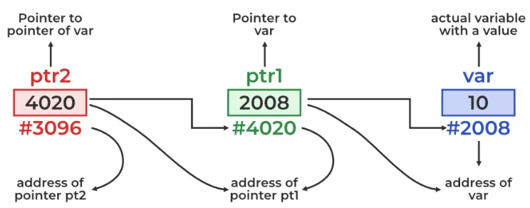
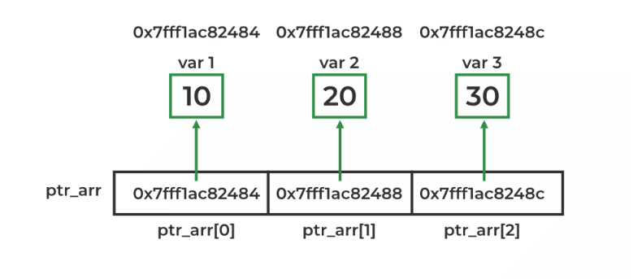
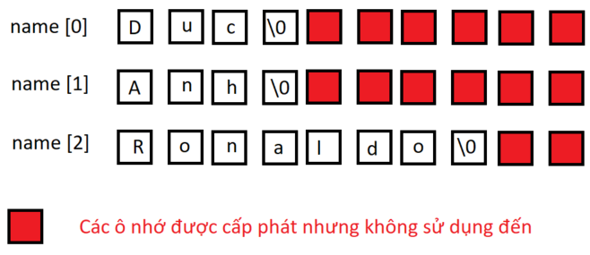

# Con trỏ cấp 1 (Pointer)

# Con trỏ cấp 2 (Pointer to pointer)

- Con trỏ cấp 2 là 1 con trỏ dùng để lưu trữ địa chỉ của 1 biến con trỏ khác
  

Bản chất con trỏ cấp 2 cũng chỉ là con trỏ, chúng ta vẫn xuất được 3 giá trị liên quan tới con trỏ cấp 2 (giống như con trỏ cấp 1).

```
**ptr: giá trị mà ptr trỏ đến
*ptr: địa chỉ của con trỏ mà ptr trỏ tới
ptr: địa chỉ của **ptr
```

- **Ví dụ 1:** tổng quát về con trỏ cấp 2

```
#include "stdio.h"

int main() {
    int number = 100;
    int *ptr = &number;
    int **p_to_p = &ptr;

    printf("value of number = %d\n", number);
    printf("address of number = %p\n", &number);  // %p: hexadecimal
    printf("*\n");
    printf("value of ptr: %d\n", *ptr);
    printf("address of ptr: %p\n", &ptr);
    printf("address of number: %p\n", ptr);
    printf("*\n");
    printf("value of p_to_p: %d\n", **p_to_p);
    printf("address of p_to_p: %p\n", p_to_p);
    printf("address of ptr: %p\n", *p_to_p);  // the address that p_to_p points
    return 0;
}
```

- **Ví dụ 2:** sử dụng con trỏ cấp 2 để thay đổi địa chỉ trỏ đến của 1 con trỏ cấp 1

```
#include "stdio.h"

int **changePointer(int *pointer);

int number_a = 10;
int number_b = 20;

int *a = &number_a;
int *b = &number_b;

int main() {
    int **value = &a;
    printf("before value = %d\n", **value);
    value = changePointer(b);
    printf("after value = %d\n", **value);

    return 0;
}

int **changePointer(int *pointer) {
    int **p_to_p = &pointer;
    return p_to_p;
}
```

- **Ví dụ 3:** sử dụng con trỏ cấp 2 để cấp phát động cho con trỏ cấp 1

```
void allocateMemory(int **p_to_p, int sizeAllocate) {
    // *p_to_p = (int *)malloc(sizeAllocate * sizeof(int));
    *p_to_p = (int *)calloc(sizeAllocate, sizeof(int));  // allocate memory for address that p_to_p points to
    if (*p_to_p == NULL) {
        printf("Memory equals null\n");
    }
}
```

# Mảng con trỏ

Mảng con trỏ trong C là một mảng các con trỏ. Mỗi phần tử trong mảng là 1 con trỏ, mỗi con trỏ sẽ trỏ đến 1 đối tượng hoặc 1 vùng nhớ khác.
[Tham khảo thêm tại đây](https://www.geeksforgeeks.org/array-of-pointers-in-c/)

- Ví dụ 1: tổng quát về mảng con trỏ

```
#include <stdio.h>

int main() {
    int var1 = 10;
    int var2 = 20;
    int var3 = 30;

    // array of pointers to integers
    int* ptr_arr[3] = {&var1, &var2, &var3};

    // traversing using loop
    for (int i = 0; i < 3; i++) {
        printf("Value of var %d: %d\tAddress: %p\n", i + 1, *ptr_arr[i], ptr_arr[i]);
    }

    return 0;
}
```



- Ví dụ 2: sử dụng mảng con trỏ thay vì sử dụng dụng mảng 2 chiều
  Để lưu giá trị nhiều _string_ trong 1 _array_, trước đấy sử dụng mảng 2 chiều để lưu, như sau:

```
    char name[3][10] = { "Duc", "Anh", "Ronaldo" };
```

Việc khai báo như trên sẽ dẫn đến lãng phí bộ nhớ


```
    int main() {
        char *name[] = {
            "Duc",
            "Anh",
            "Ronaldo"};

        for (int i = 0; i < 3; i++) {
            printf("%s \n", name[i]);
        }
        return 0;
    }
```
