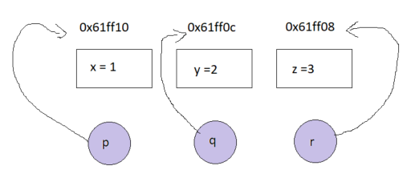
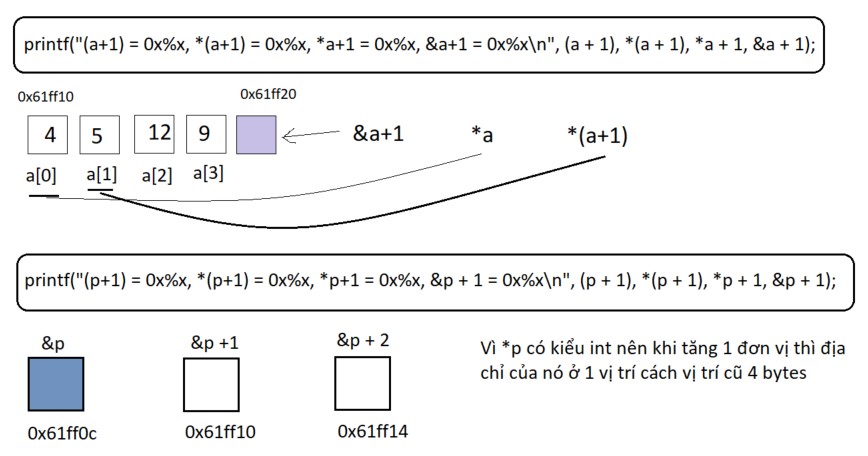

# MỤC LỤC

5. [Pointer](#question-5)
6. [String](#question-6)
7. [Struct](#question-7)
8. [Function](#question-8)

# <a id = "question-5"></a> Question 5: Pointer

## Q5.2

**Topic**

Introduce int variables x and y and int\* pointer variables p and q.
Set x to 2, y to 8, p to the address of x, and q to the address of y.
Then print the following information:

```
1. The address of x and the value of x.
2. The value of p and the value of *p.
3. The address of y and the value of y.
4. The value of q and the value of *q.
5. The address of p (not its contents!).
6. The address of q (not its contents!).
```

Use the Hex function to print all pointer/address values and format the output so it is easy to make comparisons.

**Source**

```c
#include "stdio.h"

int main() {
    int x = 2, y = 8;
    int *p = &x;
    int *q = &y;

    printf("address x = %x, address y = %x\n", &x, &y);  // 1
    printf("value p = %x, value *p = %d\n", p, *p);      // 2
    printf("address y = %x, value y = %d\n", q, *q);     // 3
    printf("value q = %x, value *q = %d\n", q, *q);      // 4
    printf("address of p= %x\n", &p);                    // 5
    printf("address of q = %x\n", &q);                   // 6
    /*
        value q hay value p là địa chỉ của y và x được 2 con trỏ này trỏ tới
    */
    return 0;
}
```

**Output**

```
address x = 61ff1c, address y = 61ff18
value p = 61ff1c, value *p = 2
address y = 61ff18, value y = 8
value q = 61ff18, value *q = 8
address of p= 61ff14
address of q = 61ff10
```

## Q5.3

**Topic**

Introduce int variables x, y, z and int\* pointer variables p, q, r.
Set x, y, z to three distinct values. Set p, q, r to the addresses of x, y, z respectively.

```
1. Print with labels the values of x, y, z, p, q, r, *p, *q, *r.
2. Print the message: Swapping values.
3. Execute the swap code: z = x; x = y; y = z;
4. Print with labels the values of x, y, z, p, q, r, *p, *q, *r.
```

Draw diagrams to explain the results


**Source**

```c
#include "stdio.h"

int main() {
    int x = 1, y = 2, z = 3;
    int *p = &x;
    int *q = &y;
    int *r = &z;

    printf("value x = %d, value y = %d, value z = %d\n", x, y, z);
    printf("value p = 0x%x, value q = 0x%x, value r = 0x%x\n", p, q, r);
    printf("value *p = %d, value *q = %d, value *r = %d\n", *p, *q, *r);
    // Swap value for step 3
    z = x;  // z = 1
    x = y;  // x = 2
    y = z;  // y = 1
    // Show result again
    printf("value x = %d, value y = %d, value z = %d\n", x, y, z);
    printf("value p = 0x%x, value q = 0x%x, value r = 0x%x\n", p, q, r);
    printf("value *p = %d, value *q = %d, value *r = %d\n", *p, *q, *r);
    /*
        Chúng ta chỉ thay đổi giá trị của các biến chứ không thay đổi địa chỉ của chúng
        Vì thế mà p,q,r không thay đổi về mặt địa chỉ mà chúng trỏ tới
    */
    return 0;
}
```

**Output**

```
value x = 1, value y = 2, value z = 3
value p = 0x61ff10, value q = 0x61ff0c, value r = 0x61ff08
value *p = 1, value *q = 2, value *r = 3
value x = 2, value y = 1, value z = 1
value p = 0x61ff10, value q = 0x61ff0c, value r = 0x61ff08
value *p = 2, value *q = 1, value *r = 1
```

## Q5.4

**Topic**

Introduce int variables x, y, z and int\* pointer variables p, q, r.
Set x, y, z to three distinct values. Set p, q, r to the addresses of x, y, z respectively.

```
1. Print with labels the values of x, y, z, p, q, r, *p, *q, *r.
2. Print the message: Swapping pointers.
3. Execute the swap code: r = p; p = q; q = r;
4. Print with labels the values of x, y, z, p, q, r, *p, *q, *r.
```

Draw diagrams to explain the results

**Source**

```c
#include "stdio.h"

int main() {
    int x = 1, y = 2, z = 3;
    int *p = &x;
    int *q = &y;
    int *r = &z;

    printf("value x = %d, value y = %d, value z = %d\n", x, y, z);
    printf("value p = 0x%x, value q = 0x%x, value r = 0x%x\n", p, q, r);
    printf("value *p = %d, value *q = %d, value *r = %d\n", *p, *q, *r);
    // result: value p = 0x61ff10, value q = 0x61ff0c, value r = 0x61ff08
    printf("Swapping pointers!\n");
    // Swap value for step 3
    r = p;  // r = 0x61ff10
    p = q;  // p = 0x61ff0c
    q = r;  // q = 0x61ff10
    // Show result again
    printf("value x = %d, value y = %d, value z = %d\n", x, y, z);
    printf("value p = 0x%x, value q = 0x%x, value r = 0x%x\n", p, q, r);
    printf("value *p = %d, value *q = %d, value *r = %d\n", *p, *q, *r);
    return 0;
}
```

**Output**

```
value x = 1, value y = 2, value z = 3
value p = 0x61ff10, value q = 0x61ff0c, value r = 0x61ff08
value *p = 1, value *q = 2, value *r = 3
Swapping pointers!
value x = 1, value y = 2, value z = 3
value p = 0x61ff0c, value q = 0x61ff10, value r = 0x61ff10
value *p = 2, value *q = 1, value *r = 1
```

## Q5.5

**Topic**
Draw diagrams to explain the results:

```c
#include "stdio.h"

int main() {
    int a[4] = {4, 5, 12, 9};
    int *p = a;  // con trỏ p sẽ trỏ đến địa chỉ của index đầu tiên của mảng a, tức là a[0]
    /*
        a và &a là địa chỉ của mảng a, địa chỉ của phần tử đầu tiên của mảng
        *a là giá trị của phần tử đầu tiên của mảng

    */
    printf("a = 0x%x, *a = 0x%x, &a = 0x%x\n", a, *a, &a);
    /*
        p: địa chỉ mà con trỏ p trỏ tới
        *p: giá trị tại địa chỉ trỏ tới
        &p: địa chỉ riêng của con trỏ
    */
    printf("p = 0x%x, *p = 0x%x, &p = 0x%x\n", p, *p, &p);
    printf("(a+1) = 0x%x, *(a+1) = 0x%x, *a+1 = 0x%x, &a+1 = 0x%x\n", (a + 1), *(a + 1), *a + 1, &a + 1);
    printf("(p+1) = 0x%x, *(p+1) = 0x%x, *p+1 = 0x%x, &p + 1 = 0x%x\n", (p + 1), *(p + 1), *p + 1, &p + 2);
    return 0;
}
```

**Output**

```
a = 0x61ff10, *a = 0x4, &a = 0x61ff10
p = 0x61ff10, *p = 0x4, &p = 0x61ff0c
(a+1) = 0x61ff14, *(a+1) = 0x5, *a+1 = 0x5, &a+1 = 0x61ff20
(p+1) = 0x61ff14, *(p+1) = 0x5, *p+1 = 0x5, &p + 1 = 0x61ff14
```

**Explain**



## Q5.6

**Topic**

- Detect and solve problems of following program:
  ```
  void main() {
      int a[4] = {1, 2, 3, 4};
      int *p = a;
      int *p2 = new int;
      delete p;
      delete a;
      delete p2;
  }
  ```

**Source**

```c

```

**Output**

```
    Chưa làm được
```

## Q5.7

**Topic**

```
 Why should we use delete?
 When we use delete?
 Difference between delete and delete[]. Write a demo
```

**Source**

```c

```

**Output**

```

```

## Q5.8

**Topic**

Detect and solve problems of following program:

```c
#include <iostream>
using namespace std;
#define COUNT 10
#define MAX(a, b) ((a) < (b) ? (a) : (b))
void main() {
    int *p = new int[COUNT];
    int a[COUNT];
    for (int i = 0; i < sizeof(a); i++) {
        a[i] = i;
    }
    for (int i = 0; i < sizeof(a); i++) {
        p[i] = i;
    }
    for (int i = 0; i < MAX(sizeof(a), sizeof(p)); i++) {
        printf("%d %d\n", a[i], p[i]);
    }
}
```

**Solve problems**

```c
#include <iostream>
using namespace std;
#define COUNT 10
#define MAX(a, b) ((a) < (b) ? (a) : (b))
int main() {
    int *p = new int[COUNT];
    int a[COUNT];
    int size = sizeof(a);   // đưa kết quả trả về thành kiểu int
    for (int i = 0; i < size; i++) {
        a[i] = i;
    }

    for (int i = 0; i < size; i++) {
        p[i] = i;
    }

    for (int i = 0; i < MAX(sizeof(a), sizeof(p)); i++) {
        printf("%d %d\n", a[i], p[i]);
    }
    return 0;
}
```

**Giải thích**

- sizeof(a) hay sizeof(b) không trả về số lượng phần tử được cấp phát mà trả về số bytes được cấp phát
- vì thế ta khai báo 1 kiểu int rồi đưa giá trị trả về của sizeof về kiểu 'int' để khớp với biến i trong vòng for.
  **Output**

```

```

# <a id = "question-6"></a> Question 6: String

## Q6.1

**Topic**

Print a string “Hello world” to screen, by using:

- char \*st = “Hello world”
- char st1[] = {‘H’, ‘e’, ….}

**Source**

```c
#include "stdio.h"

int main() {
    char *st = "Hello world";
    char st1[] = {'H', 'e', 'l', 'l', 'o', ' ', 'w', 'o', 'r', 'l', 'd'};
    int length = 0;

    while (st[length] != '\0') {
        length++;
    }
    for (int i = 0; i < length; i++) {
        printf("%c", st[i]);
    }
    printf("\n", &st);
    for (int i = 0; i < length; i++) {
        printf("%c", st1[i]);
    }
}

```

**Output**

```
Hello world
Hello world
```

# Q6.2

**Topic**

Implement a function to clone a string:
`void clone(char *input, char *output)`

**Source**

```c
#include "stdio.h"
#include "stdlib.h"

void clone(char *input, char *output) {
    int length = 0;

    while (input[length] != '\0') {
        length++;
    }
    output = (char *)malloc(length * sizeof(char));
    for (int i = 0; i <= length; i++) {
        output[i] = input[i];
    }
    printf("String after clone is %s", output);
    free(output);
}

int main() {
    char input[] = "Minh Duc Le is studying C programming";
    char *output;
    clone(input, output);
    return 0;
}

```

**Output**

```
String after clone is Minh Duc Le is studying C programming
```

# Q6.3

**Topic**

Implement a function to copy a string:
`void copyString(char *input, int offset, int length, bool invert, char *output, int output_offset)`

- input: input string
- offset: starting position for copy
- length: length of substring to be copied
- invert: invert the result
- output: output string
- output_offset: the beginning of copied position of output
- for example:
  - st = “Hello world”
  - st2 = “My name is C++”
  - copyString(st, 6, 5, true, st2, 11) => st2 = “My name is dlr”;

Implement this function in 3 ways:

- using memcpy
- using strcpy
- without memcpy and strcpy

**Source**

```c
#include "stdbool.h"
#include "stdio.h"
#include "stdlib.h"
#include "string.h"

void copyStringUsingMemcpy(char *input, int offset, int length, bool invert, char *output, int output_offset);
void copyStringUsingStrcpy(char *input, int offset, int length, bool invert, char *output, int output_offset);

int main() {
    char st[] = "Hello world";
    char st2[] = "My name is C++";
    printf("Before: %s\n", st2);
    copyStringUsingStrcpy(st, 2, 7, false, st2, 11);
    printf("After: %s\n", st2);
    return 0;
}

void copyStringUsingMemcpy(char *input, int offset, int length, bool invert, char *output, int output_offset) {
    char *stringInvert = (char *)malloc((length) * sizeof(char));
    /*
        Tạo ra 1 mảng 'stringInvert' để lưu chuỗi cần được copy
        Chuỗi này bắt đầu từ vị trí 'offset', có độ dài là 'length'
    */
    memcpy(stringInvert, &input[offset], length);
    stringInvert[length] = '\0';
    /*
        Đảo chuỗi cần được copy vào output[], nếu invert = true
    */
    if (invert) {
        int stringInvert_length = strlen(stringInvert);
        for (int i = 0; i < stringInvert_length / 2; i++) {
            char stringInvert_char = stringInvert[i];
            stringInvert[i] = stringInvert[stringInvert_length - i - 1];
            stringInvert[stringInvert_length - i - 1] = stringInvert_char;
        }
    }

    /*
        Copy chuỗi đã đảo vào output, bắt đầu từ vị trí 'output_offset'
    */
    int indexInvert = 0;
    while (stringInvert[indexInvert] != '\0') {
        output[output_offset] = stringInvert[indexInvert];
        output_offset++;
        indexInvert++;
    }
    output[output_offset] = '\0';
    free(stringInvert);
}

void copyStringUsingStrcpy(char *input, int offset, int length, bool invert, char *output, int output_offset) {
    char *stringInvert = (char *)malloc((length) * sizeof(char));
    /*
        Tạo ra 1 mảng 'stringInvert' để lưu chuỗi cần được copy
        Chuỗi này bắt đầu từ vị trí 'offset', có độ dài là 'length'
    */
    int indexInvert = 0;
    for (int i = offset; i < offset + length; i++) {
        stringInvert[indexInvert] = input[i];
        indexInvert++;
    }
    stringInvert[indexInvert] = '\0';
    /*
        Đảo chuỗi cần được copy vào output[], nếu invert = true
    */
    if (invert) {
        int stringInvert_length = strlen(stringInvert);
        for (int i = 0; i < stringInvert_length / 2; i++) {
            char stringInvert_char = stringInvert[i];
            stringInvert[i] = stringInvert[stringInvert_length - i - 1];
            stringInvert[stringInvert_length - i - 1] = stringInvert_char;
        }
    }
    /*
        Copy chuỗi đã đảo vào output, bắt đầu từ vị trí 'output_offset'
    */
    strcpy(&output[output_offset], stringInvert);
    free(stringInvert);
}


```

**Output**

```
Before: My name is C++
After: My name is dlrow
```

# <a id = "question-7"></a> Question 7: Struct

# <a id = "question-8"></a> Question 8: Function

## Q8.1

**Topic**
Implement a function function SayHello, to print screen “Hello world”

- No parameter
- A string, print to screen “hello world” and that string
- A string, and a bool: If bool value is true, convert to string to capital; print to screen “hello world” and modified string. (bool parameter has default value is false).

**Source**

```c
#include "ctype.h"
#include "stdbool.h"
#include "stdio.h"

void convertStringToCapital(char* str, bool isCapital) {
    /*
        Đưa chuỗi về viết hoa hết
    */
    if (isCapital) {
        int i = 0;
        while (str[i] != '\0') {
            str[i] = toupper(str[i]);
            i++;
        }
    /*
        Đưa chuỗi về viết thường hết
    */
    } else {
        int i = 0;
        while (str[i] != '\0') {
            str[i] = tolower(str[i]);
            i++;
        }
    }
}

int main() {
    char str[] = "Hello world!";

    printf("Before: %s\n", str);

    convertStringToCapital(str, false);

    printf("After: %s\n", str);

    return 0;
}

```

**Ouput**

```
Before: Hello world!
After: hello world!
```

## Q8.2

**Topic**
Implement a sort function (bubble sort) with unknown order preference (ascending or descending).
The order preference is decided by a pointer function parameter.

```
void sort(int *arr, int sizeArr, int (*order) (int, int));
int CheckBigger(int a, int b) {return a>b;}
int CheckSmaller(int a, int b) {return a<b;}
```

**Source**

```c
#include "stdio.h"
#include "stdlib.h"

void bubbleSort(int* arr, int sizeArr, int (*order)(int, int));
int CheckSmaller(int a, int b);
int CheckBigger(int a, int b);
void swap(int* a, int* b);
void printArray(int arrayPrint[], int sizeArray);

int main() {
    int arrayNumber[] = {8, 54, 12, 43, 62, 48, 16, 1, 8, 9};
    int sizeArray = sizeof(arrayNumber) / sizeof(arrayNumber[0]);
    printf("*Original array: \n");
    printArray(arrayNumber, sizeArray);

    bubbleSort(arrayNumber, sizeArray, CheckSmaller);

    printf("*Sorted array: \n");
    printArray(arrayNumber, sizeArray);
    return 0;
}

/*
    Thuật toán này cho phép duyệt phần tử của 1 mảng 2 lần:
        duyệt 2 lần xuôi
        duyệt 1 lần xuô + 1 lần ngược
    Cả 2 cách duyệt trên đều tuân theo ý tưởng của thuật toán là 'nổi bọt':
        tức là ta sẽ lấy phần tử nhỏ nhất / lớn nhất để sắp sếp về phía đầu hoặc cuối của mảng
        sau đấy lại cho duyệt các phần tử còn lại để sắp xếp
*/
void bubbleSort(int* arr, int sizeArr, int (*order)(int, int)) {
    for (int i = 0; i < sizeArr; i++) {
        for (int j = sizeArr - 1; j > i; j--) {
            if (order(arr[j], arr[j - 1])) {
                swap(&arr[j], &arr[j - 1]);
            }
        }
    }
}
int CheckBigger(int a, int b) {
    return a > b;
}

int CheckSmaller(int a, int b) {
    return a < b;
}

void swap(int* a, int* b) {
    int t = *a;
    *a = *b;
    *b = t;
}
void printArray(int arrayPrint[], int sizeArray) {
    for (int i = 0; i < sizeArray; i++) {
        printf("%d ", arrayPrint[i]);
    }
    printf("\n");
}
```

**Ouput**

```c
PS C:\Users\duc5.le\Downloads\SelfStudyCProgramming\PracticeExercise> gcc main.c
PS C:\Users\duc5.le\Downloads\SelfStudyCProgramming\PracticeExercise> .\a.exe
*Original array:
8 54 12 43 62 48 16 1 8 9
*Sorted array:
62 54 48 43 16 12 9 8 8 1
PS C:\Users\duc5.le\Downloads\SelfStudyCProgramming\PracticeExercise> gcc main.c
PS C:\Users\duc5.le\Downloads\SelfStudyCProgramming\PracticeExercise> .\a.exe
*Original array:
8 54 12 43 62 48 16 1 8 9
*Sorted array:
1 8 8 9 12 16 43 48 54 62
```

## Q8.3

**Topic**

**Source**

```c

```

**Ouput**
