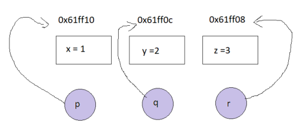
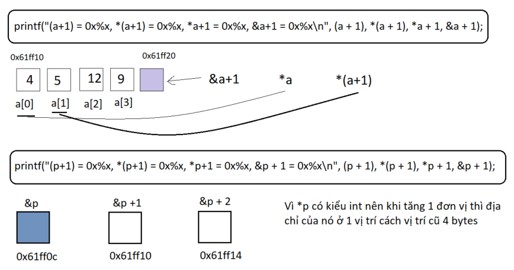

# MỤC LỤC

[Question 1: Hello world](#question-1)
[Question 2: Variable](#question-2)
[Question 3:Primary data type](#question-3)
[Question 4: Array](#question-4)
[Question 5: Pointer](#question-5)
[Question 6: String](#question-6)
[Question 7: Struct](#question-7)
[Question 8: Function](#question-8)

# <a id = "question-1"></a> Question 1: Hello world

**Topic**
Modified entry point like:

```
#include <stdio.h>

int main(int n, char** args) {
    printf("Number of Param %d\n", n);
    for (int i = 0; i < n; i++) {
        printf("param[%d] = %s\n", i, args[i]);
    }
}
```

Try to run, and watch the result in console screen and explain.
**Output**

```c
PS C:\Users\duc5.le\Downloads\SelfStudyCProgramming\PracticeExercise> gcc main.c
PS C:\Users\duc5.le\Downloads\SelfStudyCProgramming\PracticeExercise> .\a.exe param1 param2
Number of Param 3
param[0] = C:\Users\duc5.le\Downloads\SelfStudyCProgramming\PracticeExercise\a.exe
param[1] = param1
param[2] = param2
PS C:\Users\duc5.le\Downloads\SelfStudyCProgramming\PracticeExercise>
```

**Explain**
Hàm main có 2 tham số truyền vào đại diện cho các option được đưa vào khi run lệnh

- n đại diện cho số lương tham số truyền vào
- args là 1 con trỏ, trỏ tới 1 mảng chứa địa chỉ các tham số được truyền vào

Nhờ vào các tham số này, bạn có thể truy cập và sử dụng các đối số dòng lệnh khi chạy chương trình.

# <a id = "question-2"></a> Question 2: Variable

## Q2.1

**Topic**
Implement the following

```c
#include <stdio.h>

void calculate(int val) {
    static int count = 10;
    static int value;
    printf("value = %d, count = %d\n", value, count++);
    value = val;
}
int main(int n, char** args) {
    int i, j;
    calculate(i);
    calculate(j);
}
```

Look at the result and explain why?

**Output**

```c
value = 0, count = 10
value = 4194432, count = 11
```

**Explain**

- Biến static là gì?
  [Tham khảo tại đây!](https://github.com/MinhDucLeHUST/FundamentalCProgramming/blob/master/Day1_Compile%20Process_Variable_Types/Theory.MD#day-1-compile-process-variables-types)
- Ở dòng đầu tiên, giá trị count = 10 vì là count ++, giá trị count sẽ tăng sau khi được gọi (nếu sử dụng ++count thì count = 11). Giá trị value = 0 vì được khai báo là biến static local (không gán giá trị).
- Ở dòng thứ 2, giá trị count được tăng lên 1 đơn vị, giá trị value là 1 giá trị rác vì nó được gán với 1 biến local được gọi từ hàm _main_

## Q2.2

**Topic**
For counting number of times a function has been called, we use three ways:

- Global variable
- Static variable inside function (static local)
- Static variable outside function (static global)

Implements those ways, and compare
**Source**

```c
#include <stdio.h>

int count_global = 10;
static int count_static_global = 10;

void calculate(int val) {
    static int count_static_local = 10;
    static int value;
    printf("global variable: value = %d, count = %d\n", value, count_global++);
    printf("global static variable: value = %d, count = %d\n", value, count_static_global++);
    printf("local static variable: value = %d, count = %d\n", value, count_static_local++);
    printf("=================================================\n");
    value = val;
}
int main(int n, char** args) {
    int i, j, k, l;
    calculate(i);
    calculate(j);
    calculate(k);
    calculate(l);
}
```

**Output**

```c
global variable: value = 0, count = 10
global static variable: value = 0, count = 10
local static variable: value = 0, count = 10
=================================================
global variable: value = 4194432, count = 11
global static variable: value = 4194432, count = 11
local static variable: value = 4194432, count = 11
=================================================
global variable: value = 4182016, count = 12
global static variable: value = 4182016, count = 12
local static variable: value = 4182016, count = 12
=================================================
global variable: value = 0, count = 13
global static variable: value = 0, count = 13
local static variable: value = 0, count = 13
=================================================
```

**Explain**

- 3 loại biến kể trên chỉ khác nhau về phạm vi sử dụng, còn về khả năng lưu trữ giá trị sau mỗi lần gọi thì chúng như nhau

## Q2.3

**Topic**
A programmer codes his program with 2 files: _main.c_ and _another.c_.

- In _another.c_, he declares a global variable named myVar with initial value is 10.
- In _main.c_, he needs to print value of myVar into screen. And he tries the following ways:

  - Declare myVar in another.c, and in print it in main() in main.c
  - Declare myVar in another.c. Declare again myVar in main.c and print it
  - Declare myVar in another.c. In main.c, declare myVar with extern keyword, and print it.

He’s got problem with the first and second way. The third is run well.
Please explain what happen with the first and second; explain the reason why the third is OK and try to implement it.
**Source**

```c
#include <stdio.h> //another.c

int myVar = 10;
```

```c
#include <stdio.h> //main.c

int myVar;
```

```c
#include <stdio.h> //another.c

extern int myVar = 10;
```

**Expain**

- Để sử dụng biến được khai báo trong file khác thì cần sử dụng từ khóa _extern_, nếu không chương trình không hiểu biến này được lấy từ đâu, kể cả bạn khai báo lại thì giá trị của chúng ko đồng bộ với nhau

## Q2.4

**Topic**

Detect & solve problem of the following code:

```c
#include <stdio.h>
const int xyz;
int main(int n, char** args) {
    xyz = 0;
    printf("%d", xyz);
}
```

**Explain**

- Biến const được khai báo với 1 giá trị ko đổi, vì thế khi gán lại giá trị cho biến _xyz_ thì chương trình báo lỗi.

# <a id = "question-3"></a> Question 3: Primary data type

## Q3.1

**Topic**
Run the following code, and explain the result.

- If replacing “char c” with “unsigned char c”, what will happen, and why?
- Set “i” value to 260. Explain the result.
- Supposing that “i” is always from 0 to 255. Try to give a solution to get j’s value equal to i’s value. (does not used unsigned char)

```c
#include <stdio.h>

int main(int n, char** args) {
    int i = 140;
    char c = i;
    int j = c;
    printf("%d", j);
}
```

**Explain**

- Nếu thay char bằng unsigned char thì giá trị in ra là **140** thì range của unsigned char từ 0-255, còn char là từ -128 đến 127, vì thế khi quá giá trị 127, thì nó sẽ quay ngược lại neen có giá trị **-116**
- Để giải quyết vấn đề thứ 3, sử phép toán tử **&** với **0xFF**, vì bản chất của 140 đưa về mã nhị phân, khi convert sang char thì nó sẽ được ép kiểu theo dải giá trị của char, vì thế để giá trị của i = j thì phải bảo toàn được giá trị nhị phân của nó.

```c
#include <stdio.h>

int main(int n, char** args) {
    int i = 140;
    char c = i;
    int j = c&0xFF;
    printf("%d", j);
}
```

## Q3.2

**Topic**
Run the following code, and explain the result.

```c
#include <stdio.h>
#include "unistd.h"

int main(int n, char** args) {
    printf("Start loop\n");
    int i = 5;
    while (i = 5) {
        printf("Inside loop\n");
        i--;
        printf("%d\n", i);
        sleep(1);
    }

    printf("Outside loop\n");
    return 0;
}
```

**Explain**

- Chương trình không thoát được vòng lặp vô hạn vì **i=5** là sai, sửa thành **i == 5**, khác nhau ở đây là 1 cái là phép gán và 1 cái là phép so sánh, sử dụng 1 dấu **=** thì chương trình hiểu bạn gán i = 5 thì chương trình của bạn không thoát được khỏi vòng while.
- Cho dù có thay đổi giá trị của i bên trong while loop như nào đi chăng nữa thì nó vẫn thế.

# <a id = "question-4"></a> Question 4: Array

## Q4.1

**Topic**

- Write program to ask the user to type 10 integers of an array.
- The program must compute and write the number of integers greater or equal to 10.

**Source**

```c
#include <stdio.h>
#define SIZE_ARRAY 10
int main(int n, char** args) {
    int array[SIZE_ARRAY];
    int countEqual = 0;
    int countGreater = 0;
    printf("Insert 10 value for array!\n");
    for (int i = 0; i < SIZE_ARRAY; i++) {
        scanf("%d", &array[i]);
    }
    // scan value in array
    for (int i = 0; i < SIZE_ARRAY; i++) {
        if (array[i] == 10)
            countEqual++;
        else if (array[i] > 10)
            countGreater++;
    }
    printf("Equal 10 has %d number in array\n", countEqual);
    printf("Greater 10 has %d number in array\n", countGreater);
    return 0;
}
```

**Output**

```c
Insert 10 value for array!
10
20
1
3
10
11
12
10
2
1
Equal 10 has 3 number in array
Greater 10 has 3 number in array
```

## Q4.2

**Topic**
Write a program which takes 2 arrays of 10 integers each, a and b. c is an array with 20 integers. The program should put into c the appending of b to a, the first 10 integers of c from array a, the latter 10 from b. Then the program should display c.

- Use memcpy
- Without memcpy
  **Source**

```c
#include <stdio.h>
#include "string.h"

#define SIZE_ARRAY 10
int main(int n, char** args) {
    int a[SIZE_ARRAY] = {1, 2, 3, 4, 5, 6, 7, 8, 9, 10};
    int b[SIZE_ARRAY] = {11, 12, 13, 14, 15, 16, 17, 18, 19, 20};
    int c[2 * SIZE_ARRAY];
    for (int i = 0; i < SIZE_ARRAY; i++) {
        memcpy(&c[i], &a[i], SIZE_ARRAY);
    }
    for (int i = 0; i < SIZE_ARRAY; i++) {
        memcpy(&c[SIZE_ARRAY + i], &b[i], SIZE_ARRAY);
    }
    // scan value in array
    for (int i = 0; i < 2 * SIZE_ARRAY; i++) {
        printf("%d ", c[i]);
    }

    return 0;
}
```

**Output**
`1 2 3 4 5 6 7 8 9 10 11 12 13 14 15 16 17 18 19 20 `

## Q4.3

**Topic**
Explain the result:

```c
#include <stdio.h>

int main(int n, char** args) {
    int a[10];
    for (int i = 0; i < 10; i++) {
        a[i] = i * 10;
    }
    printf("a = 0x%x, *a =  0x%x, &a =  0x%x\n", a, *a, &a);
    printf("(a+1) = 0x%x, *(a+1) = 0x%x, *a + 1 = 0x%x, &a+1 = 0x%x\n", (a + 1), *(a + 1), *a + 1, &a + 1);
}
```

**Output**

```c
a = 0x61fef4, *a =  0x0, &a =  0x61fef4
(a+1) = 0x61fef8, *(a+1) = 0xa, *a + 1 = 0x1, &a+1 = 0x61ff1c
```

**Explain**

- a là địa chỉ của phần tử đầu tiên trong mảng, tương tự như &a
- \*a là giá trị của phần tử đầu tiên trong mảng
- (a+1) là địa chị của phần tử tiếp theo trong mảng, cách nhau 4 byte vì mảng có kiểu **int**
- \*(a+1) là giá trị của phần tử tiếp theo trong mảng
- \*a + 1 là giá trị của phần tử đấy tăng thêm 1 đơn vị
- &a + 1 là địa chỉ ngay sau phần tử cuối cùng của mảng

## Q4.4

**Topic**
Implement bubble sort algorithm (sort acceding) to sort an array from “offset” with “count” elements.
For example: a[5] = {100, 4, 2, 6, 3} -> sort(a, 1, 4) -> {100, 2, 3, 4, 6}
`void bubbleSort(int arr[], int offset, int count)`
**Source**

```c
#include "stdio.h"
#include "stdlib.h"

void bubbleSort(int arr[], int offset, int count);
void swap(int* a, int* b);
void printArray(int arrayPrint[], int sizeArray);

int main() {
    int arrayNumber[] = {8, 54, 12, 43, 62, 48, 16, 1, 8, 9};
    int sizeArray = sizeof(arrayNumber) / sizeof(arrayNumber[0]);
    printf("*Original array: \n");
    printArray(arrayNumber, sizeArray);

    bubbleSort(arrayNumber, 1, sizeArray);

    printf("*Sorted array: \n");
    printArray(arrayNumber, sizeArray);
    return 0;
}

void bubbleSort(int arr[], int offset, int count) {
    for (int i = offset; i < count; i++) {
        for (int j = count - 1; j > i; j--) {
            if (arr[j] < arr[j - 1]) {
                swap(&arr[j], &arr[j - 1]);
            }
        }
    }
}

void swap(int* a, int* b) {
    int t = *a;
    *a = *b;
    *b = t;
}
void printArray(int arrayPrint[], int sizeArray) {
    for (int i = 0; i < sizeArray; i++) {
        printf("%d ", arrayPrint[i]);
    }
    printf("\n");
}

```

**Output**

```c
*Original array:
8 54 12 43 62 48 16 1 8 9
*Sorted array:
8 1 8 9 12 16 43 48 54 62
```

## Q4.5

**Topic**
Implement functions to invert member of an array

```c
// generate output array from inverted input
void Invert(int input[], int num_element, int output[])
// invert input array
void Invert(int input[], int num_element)
```

Note: after executing this function, input array is not changed
**Source**

```c
void Invert(int input[], int num_element) {
    for (int i = 0; i < num_element / 2; i++) {
        swap(&input[i], &input[num_element - 1 - i]);
    }
}
```

**Output**

```c
*Original array:
1 2 3 4 5 6 7 8
*Inverted array:
8 7 6 5 4 3 2 1
```

# <a id = "question-5"></a> Question 5: Pointer

## Q5.1

**Topic**
Explain the result

```c
#include "stdio.h"
#include "stdlib.h"
typedef int *IntPtrType;
int main() {
    IntPtrType ptr_a, ptr_b, *ptr_c;
    ptr_a = (int *)malloc(sizeof(int));
    *ptr_a = 3;
    ptr_b = ptr_a;
    printf("*ptr_a = %d, * ptr_b = %d\n", *ptr_a, *ptr_b);

    ptr_b = (int *)malloc(sizeof(int));
    *ptr_b = 9;
    printf("*ptr_a = %d, * ptr_b = %d\n", *ptr_a, *ptr_b);

    *ptr_b = *ptr_a;
    printf("*ptr_a = %d, * ptr_b = %d\n", *ptr_a, *ptr_b);

    free(ptr_a);
    ptr_a = ptr_b;
    printf("*ptr_a = %d, *&*&*&*&*ptr_b = %d\n", *ptr_a, *&*&*&*&*ptr_b);

    ptr_c = &ptr_a;
    printf("*ptr_c = 0x%x, **ptr_c = %d\n", *ptr_c, **ptr_c);

    free(ptr_a);
    ptr_a = NULL;
    return 0;
}
```

**Output**

```c
*ptr_a = 3, * ptr_b = 3
*ptr_a = 3, * ptr_b = 9
*ptr_a = 3, * ptr_b = 3
*ptr_a = 3, *&*&*&*&*ptr_b = 3
*ptr_c = 0x662b98, **ptr_c = 3
```

**Explain**

- Về mặt giá trị của ptr_a và ptr_b là cơ bản, đơn giản thì là các phép gán
- Khi free(ptr_a), con trỏ ptr_a được giải phóng, sau đấy đc gán với ptr_b, lúc này 2 con trỏ ptr_a và ptr_b cùng trỏ đến 1 địa chỉ, chúng có cùng giá trị và địa chỉ trỏ đến.
- `*&*&*&*&*ptr_b` = 3 vì _ kết hợp & thì thành không có ký tự gì, vì thế ở đây dễ hiểu `_&_&_&*&*ptr_b` chính và \*ptr_b

## Q5.2

**Topic**

Introduce int variables x and y and int\* pointer variables p and q.
Set x to 2, y to 8, p to the address of x, and q to the address of y.
Then print the following information:

```
1. The address of x and the value of x.
2. The value of p and the value of *p.
3. The address of y and the value of y.
4. The value of q and the value of *q.
5. The address of p (not its contents!).
6. The address of q (not its contents!).
```

Use the Hex function to print all pointer/address values and format the output so it is easy to make comparisons.

**Source**

```c
#include "stdio.h"

int main() {
    int x = 2, y = 8;
    int *p = &x;
    int *q = &y;

    printf("address x = %x, address y = %x\n", &x, &y);  // 1
    printf("value p = %x, value *p = %d\n", p, *p);      // 2
    printf("address y = %x, value y = %d\n", q, *q);     // 3
    printf("value q = %x, value *q = %d\n", q, *q);      // 4
    printf("address of p= %x\n", &p);                    // 5
    printf("address of q = %x\n", &q);                   // 6
    /*
        value q hay value p là địa chỉ của y và x được 2 con trỏ này trỏ tới
    */
    return 0;
}
```

**Output**

```
address x = 61ff1c, address y = 61ff18
value p = 61ff1c, value *p = 2
address y = 61ff18, value y = 8
value q = 61ff18, value *q = 8
address of p= 61ff14
address of q = 61ff10
```

## Q5.3

**Topic**

Introduce int variables x, y, z and int\* pointer variables p, q, r.
Set x, y, z to three distinct values. Set p, q, r to the addresses of x, y, z respectively.

```
1. Print with labels the values of x, y, z, p, q, r, *p, *q, *r.
2. Print the message: Swapping values.
3. Execute the swap code: z = x; x = y; y = z;
4. Print with labels the values of x, y, z, p, q, r, *p, *q, *r.
```

Draw diagrams to explain the results


**Source**

```c
#include "stdio.h"

int main() {
    int x = 1, y = 2, z = 3;
    int *p = &x;
    int *q = &y;
    int *r = &z;

    printf("value x = %d, value y = %d, value z = %d\n", x, y, z);
    printf("value p = 0x%x, value q = 0x%x, value r = 0x%x\n", p, q, r);
    printf("value *p = %d, value *q = %d, value *r = %d\n", *p, *q, *r);
    // Swap value for step 3
    z = x;  // z = 1
    x = y;  // x = 2
    y = z;  // y = 1
    // Show result again
    printf("value x = %d, value y = %d, value z = %d\n", x, y, z);
    printf("value p = 0x%x, value q = 0x%x, value r = 0x%x\n", p, q, r);
    printf("value *p = %d, value *q = %d, value *r = %d\n", *p, *q, *r);
    /*
        Chúng ta chỉ thay đổi giá trị của các biến chứ không thay đổi địa chỉ của chúng
        Vì thế mà p,q,r không thay đổi về mặt địa chỉ mà chúng trỏ tới
    */
    return 0;
}
```

**Output**

```
value x = 1, value y = 2, value z = 3
value p = 0x61ff10, value q = 0x61ff0c, value r = 0x61ff08
value *p = 1, value *q = 2, value *r = 3
value x = 2, value y = 1, value z = 1
value p = 0x61ff10, value q = 0x61ff0c, value r = 0x61ff08
value *p = 2, value *q = 1, value *r = 1
```

## Q5.4

**Topic**

Introduce int variables x, y, z and int\* pointer variables p, q, r.
Set x, y, z to three distinct values. Set p, q, r to the addresses of x, y, z respectively.

```
1. Print with labels the values of x, y, z, p, q, r, *p, *q, *r.
2. Print the message: Swapping pointers.
3. Execute the swap code: r = p; p = q; q = r;
4. Print with labels the values of x, y, z, p, q, r, *p, *q, *r.
```

Draw diagrams to explain the results

**Source**

```c
#include "stdio.h"

int main() {
    int x = 1, y = 2, z = 3;
    int *p = &x;
    int *q = &y;
    int *r = &z;

    printf("value x = %d, value y = %d, value z = %d\n", x, y, z);
    printf("value p = 0x%x, value q = 0x%x, value r = 0x%x\n", p, q, r);
    printf("value *p = %d, value *q = %d, value *r = %d\n", *p, *q, *r);
    // result: value p = 0x61ff10, value q = 0x61ff0c, value r = 0x61ff08
    printf("Swapping pointers!\n");
    // Swap value for step 3
    r = p;  // r = 0x61ff10
    p = q;  // p = 0x61ff0c
    q = r;  // q = 0x61ff10
    // Show result again
    printf("value x = %d, value y = %d, value z = %d\n", x, y, z);
    printf("value p = 0x%x, value q = 0x%x, value r = 0x%x\n", p, q, r);
    printf("value *p = %d, value *q = %d, value *r = %d\n", *p, *q, *r);
    return 0;
}
```

**Output**

```
value x = 1, value y = 2, value z = 3
value p = 0x61ff10, value q = 0x61ff0c, value r = 0x61ff08
value *p = 1, value *q = 2, value *r = 3
Swapping pointers!
value x = 1, value y = 2, value z = 3
value p = 0x61ff0c, value q = 0x61ff10, value r = 0x61ff10
value *p = 2, value *q = 1, value *r = 1
```

## Q5.5

**Topic**
Draw diagrams to explain the results:

```c
#include "stdio.h"

int main() {
    int a[4] = {4, 5, 12, 9};
    int *p = a;  // con trỏ p sẽ trỏ đến địa chỉ của index đầu tiên của mảng a, tức là a[0]
    /*
        a và &a là địa chỉ của mảng a, địa chỉ của phần tử đầu tiên của mảng
        *a là giá trị của phần tử đầu tiên của mảng

    */
    printf("a = 0x%x, *a = 0x%x, &a = 0x%x\n", a, *a, &a);
    /*
        p: địa chỉ mà con trỏ p trỏ tới
        *p: giá trị tại địa chỉ trỏ tới
        &p: địa chỉ riêng của con trỏ
    */
    printf("p = 0x%x, *p = 0x%x, &p = 0x%x\n", p, *p, &p);
    printf("(a+1) = 0x%x, *(a+1) = 0x%x, *a+1 = 0x%x, &a+1 = 0x%x\n", (a + 1), *(a + 1), *a + 1, &a + 1);
    printf("(p+1) = 0x%x, *(p+1) = 0x%x, *p+1 = 0x%x, &p + 1 = 0x%x\n", (p + 1), *(p + 1), *p + 1, &p + 2);
    return 0;
}
```

**Output**

```
a = 0x61ff10, *a = 0x4, &a = 0x61ff10
p = 0x61ff10, *p = 0x4, &p = 0x61ff0c
(a+1) = 0x61ff14, *(a+1) = 0x5, *a+1 = 0x5, &a+1 = 0x61ff20
(p+1) = 0x61ff14, *(p+1) = 0x5, *p+1 = 0x5, &p + 1 = 0x61ff14
```

**Explain**



## Q5.6

**Topic**

- Detect and solve problems of following program:
  ```
  void main() {
      int a[4] = {1, 2, 3, 4};
      int *p = a;
      int *p2 = new int;
      delete p;
      delete a;
      delete p2;
  }
  ```

**Source**

```c

```

**Output**

```
    Chưa làm được
```

## Q5.7

**Topic**

```
 Why should we use delete?
 When we use delete?
 Difference between delete and delete[]. Write a demo
```

**Source**

```c

```

**Output**

```

```

## Q5.8

**Topic**

Detect and solve problems of following program:

```c
#include <iostream>
using namespace std;
#define COUNT 10
#define MAX(a, b) ((a) < (b) ? (a) : (b))
void main() {
    int *p = new int[COUNT];
    int a[COUNT];
    for (int i = 0; i < sizeof(a); i++) {
        a[i] = i;
    }
    for (int i = 0; i < sizeof(a); i++) {
        p[i] = i;
    }
    for (int i = 0; i < MAX(sizeof(a), sizeof(p)); i++) {
        printf("%d %d\n", a[i], p[i]);
    }
}
```

**Solve problems**

```c
#include <iostream>
using namespace std;
#define COUNT 10
#define MAX(a, b) ((a) < (b) ? (a) : (b))
int main() {
    int *p = new int[COUNT];
    int a[COUNT];
    int size = sizeof(a);   // đưa kết quả trả về thành kiểu int
    for (int i = 0; i < size; i++) {
        a[i] = i;
    }

    for (int i = 0; i < size; i++) {
        p[i] = i;
    }

    for (int i = 0; i < MAX(sizeof(a), sizeof(p)); i++) {
        printf("%d %d\n", a[i], p[i]);
    }
    return 0;
}
```

**Giải thích**

- sizeof(a) hay sizeof(b) không trả về số lượng phần tử được cấp phát mà trả về số bytes được cấp phát
- vì thế ta khai báo 1 kiểu int rồi đưa giá trị trả về của sizeof về kiểu 'int' để khớp với biến i trong vòng for.
  **Output**

```

```

# <a id = "question-6"></a> Question 6: String

## Q6.1

**Topic**

Print a string “Hello world” to screen, by using:

- char \*st = “Hello world”
- char st1[] = {‘H’, ‘e’, ….}

**Source**

```c
#include "stdio.h"

int main() {
    char *st = "Hello world";
    char st1[] = {'H', 'e', 'l', 'l', 'o', ' ', 'w', 'o', 'r', 'l', 'd'};
    int length = 0;

    while (st[length] != '\0') {
        length++;
    }
    for (int i = 0; i < length; i++) {
        printf("%c", st[i]);
    }
    printf("\n", &st);
    for (int i = 0; i < length; i++) {
        printf("%c", st1[i]);
    }
}

```

**Output**

```
Hello world
Hello world
```

# Q6.2

**Topic**

Implement a function to clone a string:
`void clone(char *input, char *output)`

**Source**

```c
#include "stdio.h"
#include "stdlib.h"

void clone(char *input, char *output) {
    int length = 0;

    while (input[length] != '\0') {
        length++;
    }
    output = (char *)malloc(length * sizeof(char));
    for (int i = 0; i <= length; i++) {
        output[i] = input[i];
    }
    printf("String after clone is %s", output);
    free(output);
}

int main() {
    char input[] = "Minh Duc Le is studying C programming";
    char *output;
    clone(input, output);
    return 0;
}

```

**Output**

```
String after clone is Minh Duc Le is studying C programming
```

# Q6.3

**Topic**

Implement a function to copy a string:
`void copyString(char *input, int offset, int length, bool invert, char *output, int output_offset)`

- input: input string
- offset: starting position for copy
- length: length of substring to be copied
- invert: invert the result
- output: output string
- output_offset: the beginning of copied position of output
- for example:
  - st = “Hello world”
  - st2 = “My name is C++”
  - copyString(st, 6, 5, true, st2, 11) => st2 = “My name is dlr”;

Implement this function in 3 ways:

- using memcpy
- using strcpy
- without memcpy and strcpy

**Source**

```c
#include "stdbool.h"
#include "stdio.h"
#include "stdlib.h"
#include "string.h"

void copyStringUsingMemcpy(char *input, int offset, int length, bool invert, char *output, int output_offset);
void copyStringUsingStrcpy(char *input, int offset, int length, bool invert, char *output, int output_offset);

int main() {
    char st[] = "Hello world";
    char st2[] = "My name is C++";
    printf("Before: %s\n", st2);
    copyStringUsingStrcpy(st, 2, 7, false, st2, 11);
    printf("After: %s\n", st2);
    return 0;
}

void copyStringUsingMemcpy(char *input, int offset, int length, bool invert, char *output, int output_offset) {
    char *stringInvert = (char *)malloc((length) * sizeof(char));
    /*
        Tạo ra 1 mảng 'stringInvert' để lưu chuỗi cần được copy
        Chuỗi này bắt đầu từ vị trí 'offset', có độ dài là 'length'
    */
    memcpy(stringInvert, &input[offset], length);
    stringInvert[length] = '\0';
    /*
        Đảo chuỗi cần được copy vào output[], nếu invert = true
    */
    if (invert) {
        int stringInvert_length = strlen(stringInvert);
        for (int i = 0; i < stringInvert_length / 2; i++) {
            char stringInvert_char = stringInvert[i];
            stringInvert[i] = stringInvert[stringInvert_length - i - 1];
            stringInvert[stringInvert_length - i - 1] = stringInvert_char;
        }
    }

    /*
        Copy chuỗi đã đảo vào output, bắt đầu từ vị trí 'output_offset'
    */
    int indexInvert = 0;
    while (stringInvert[indexInvert] != '\0') {
        output[output_offset] = stringInvert[indexInvert];
        output_offset++;
        indexInvert++;
    }
    output[output_offset] = '\0';
    free(stringInvert);
}

void copyStringUsingStrcpy(char *input, int offset, int length, bool invert, char *output, int output_offset) {
    char *stringInvert = (char *)malloc((length) * sizeof(char));
    /*
        Tạo ra 1 mảng 'stringInvert' để lưu chuỗi cần được copy
        Chuỗi này bắt đầu từ vị trí 'offset', có độ dài là 'length'
    */
    int indexInvert = 0;
    for (int i = offset; i < offset + length; i++) {
        stringInvert[indexInvert] = input[i];
        indexInvert++;
    }
    stringInvert[indexInvert] = '\0';
    /*
        Đảo chuỗi cần được copy vào output[], nếu invert = true
    */
    if (invert) {
        int stringInvert_length = strlen(stringInvert);
        for (int i = 0; i < stringInvert_length / 2; i++) {
            char stringInvert_char = stringInvert[i];
            stringInvert[i] = stringInvert[stringInvert_length - i - 1];
            stringInvert[stringInvert_length - i - 1] = stringInvert_char;
        }
    }
    /*
        Copy chuỗi đã đảo vào output, bắt đầu từ vị trí 'output_offset'
    */
    strcpy(&output[output_offset], stringInvert);
    free(stringInvert);
}


```

**Output**

```
Before: My name is C++
After: My name is dlrow
```

# <a id = "question-7"></a> Question 7: Struct

## Q7.1

**Topic**
Date information includes:

- Day of week : 0 for Sunday and 6 for Saturday (unsigned char)
- Day: 0..31 (unsigned char)
- Month: 0..12 (unsigned char)
- Year: xxxx (unsigned int)

Implement:

- Define struct of date
- Get date of system and save to a struct instance
- Print struct information as format:
  - dow, dd-mm-yyyy
  - dd/mm/yyyy
  - mm-dd-yyyy
  - dow dd.mm.yy

**Source**

```c
#include <stdio.h>
#include <string.h>

typedef struct {
    unsigned char dayOfWeek[10];
    unsigned char day;
    unsigned char month;
    unsigned int year;
} date_t;

int main() {
    date_t dayyyyy = {"Thusday", 16, 11, 2023};
    printf("Today is %s, %d-%d-%d\n", dayyyyy.dayOfWeek, dayyyyy.day, dayyyyy.month, dayyyyy.year);
    printf("Size of struct: %ld\n", sizeof(date_t));
    return 0;
}

```

**Output**

```c
Today is Thusday, 16-11-2023
Size of struct: 16
```

## Q7.2

**Topic**
Use struct of 7.1. Implement:

- (1) Print size of struct
- (2) Declare year in second (dow, year, day, month), and print size of struct.
  Draw diagrams to explain the result
- (3) Build project with 1 byte alignment, print size of struct in two above cases and explain the result.

**Source**

```c
//(1)
printf("Size of struct: %ld\n", sizeof(date_t));

//(2)
typedef struct {
    unsigned char dayOfWeek[10];
    unsigned int year;
    unsigned char day;
    unsigned char month;
} date_t;

//(3)
#pragma pack(1)
typedef struct {
    unsigned char dayOfWeek[10];
    unsigned int year;
    unsigned char day;
    unsigned char month;
} date_t;
#pragma pack()
```

**Ouput**

```c
//(1)
Size of struct: 16
//(2)
Size of struct: 20
//(3)
Size of struct: 16
```

## Q7.3

**Topic**

Student information include

```c
- name (char \*)
- id (int)
- score (float) (0 to 10)
```

Implement:

- Struct of student
- A class room is included ten students. (List of student is stored in an array).
- Implement a function to input the student information (check if duplicated student ID, and value of score must be in range)
- Sort list of student by score.

# <a id = "question-8"></a> Question 8: Function

## Q8.1

**Topic**
Implement a function function SayHello, to print screen “Hello world”

- No parameter
- A string, print to screen “hello world” and that string
- A string, and a bool: If bool value is true, convert to string to capital; print to screen “hello world” and modified string. (bool parameter has default value is false).

**Source**

```c
#include "ctype.h"
#include "stdbool.h"
#include "stdio.h"

void convertStringToCapital(char* str, bool isCapital) {
    /*
        Đưa chuỗi về viết hoa hết
    */
    if (isCapital) {
        int i = 0;
        while (str[i] != '\0') {
            str[i] = toupper(str[i]);
            i++;
        }
    /*
        Đưa chuỗi về viết thường hết
    */
    } else {
        int i = 0;
        while (str[i] != '\0') {
            str[i] = tolower(str[i]);
            i++;
        }
    }
}

int main() {
    char str[] = "Hello world!";

    printf("Before: %s\n", str);

    convertStringToCapital(str, false);

    printf("After: %s\n", str);

    return 0;
}

```

**Ouput**

```
Before: Hello world!
After: hello world!
```

## Q8.2

**Topic**
Implement a sort function (bubble sort) with unknown order preference (ascending or descending).
The order preference is decided by a pointer function parameter.

```
void sort(int *arr, int sizeArr, int (*order) (int, int));
int CheckBigger(int a, int b) {return a>b;}
int CheckSmaller(int a, int b) {return a<b;}
```

**Source**

```c
#include "stdio.h"
#include "stdlib.h"

void bubbleSort(int* arr, int sizeArr, int (*order)(int, int));
int CheckSmaller(int a, int b);
int CheckBigger(int a, int b);
void swap(int* a, int* b);
void printArray(int arrayPrint[], int sizeArray);

int main() {
    int arrayNumber[] = {8, 54, 12, 43, 62, 48, 16, 1, 8, 9};
    int sizeArray = sizeof(arrayNumber) / sizeof(arrayNumber[0]);
    printf("*Original array: \n");
    printArray(arrayNumber, sizeArray);

    bubbleSort(arrayNumber, sizeArray, CheckSmaller);

    printf("*Sorted array: \n");
    printArray(arrayNumber, sizeArray);
    return 0;
}

/*
    Thuật toán này cho phép duyệt phần tử của 1 mảng 2 lần:
        duyệt 2 lần xuôi
        duyệt 1 lần xuô + 1 lần ngược
    Cả 2 cách duyệt trên đều tuân theo ý tưởng của thuật toán là 'nổi bọt':
        tức là ta sẽ lấy phần tử nhỏ nhất / lớn nhất để sắp sếp về phía đầu hoặc cuối của mảng
        sau đấy lại cho duyệt các phần tử còn lại để sắp xếp
*/
void bubbleSort(int* arr, int sizeArr, int (*order)(int, int)) {
    for (int i = 0; i < sizeArr; i++) {
        for (int j = sizeArr - 1; j > i; j--) {
            if (order(arr[j], arr[j - 1])) {
                swap(&arr[j], &arr[j - 1]);
            }
        }
    }
}
int CheckBigger(int a, int b) {
    return a > b;
}

int CheckSmaller(int a, int b) {
    return a < b;
}

void swap(int* a, int* b) {
    int t = *a;
    *a = *b;
    *b = t;
}
void printArray(int arrayPrint[], int sizeArray) {
    for (int i = 0; i < sizeArray; i++) {
        printf("%d ", arrayPrint[i]);
    }
    printf("\n");
}
```

**Ouput**

```c
PS C:\Users\duc5.le\Downloads\SelfStudyCProgramming\PracticeExercise> gcc main.c
PS C:\Users\duc5.le\Downloads\SelfStudyCProgramming\PracticeExercise> .\a.exe
*Original array:
8 54 12 43 62 48 16 1 8 9
*Sorted array:
62 54 48 43 16 12 9 8 8 1
PS C:\Users\duc5.le\Downloads\SelfStudyCProgramming\PracticeExercise> gcc main.c
PS C:\Users\duc5.le\Downloads\SelfStudyCProgramming\PracticeExercise> .\a.exe
*Original array:
8 54 12 43 62 48 16 1 8 9
*Sorted array:
1 8 8 9 12 16 43 48 54 62
```

## Q8.3

**Topic**
Same requirement as Q8.2, however, sort function is implemented in another file:
_Using extern_

**Source**

```c
extern void bubbleSort(int* arr, int sizeArr, int (*order)(int, int));
```
