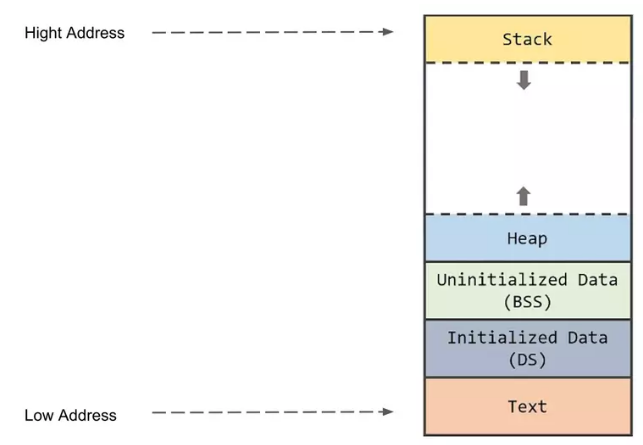
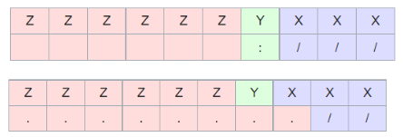

# <a id = "memory-layout"></a> 1. Memory layout

Memory layout của 1 chương trình C/C++ bao gồm 5 phần chính: Stack, Heap, BSS, DS, Text


## <a id = "text-segment"></a> 1.1. Text segment

- Text segment là vùng địa chỉ thấp nhất, đây là phần chứa các đoạn mã lệnh của chương trình, được đặt ở dưới Stack và Heap để tránh việc bị ghi đè dữ liệu khi xảy ra overflow.
- Text segment là vùng nhớ có thể chia sẻ được, vì thế có duy nhất 1 bản copy của vùng nhớ này cho phép cho phép các chương trình thường xuyên được thực hiện như: text editors, C compiler, shells, ...

## <a id = "inittialized-data"></a> 1.2. Initialized Data Segment (DS)

- Initialized Data Segment là nơi lưu trữ **global variables** , **static variables** với điều kiện các biến này được khởi tạo với các giá trị khác 0.

```c
int global = 100;
int foo() {
    static int number = 10;
    return 0;
}
```

- Trong đoạn chương chính trên, biến global được khởi tạo với giá trị 100, và biến static number được khởi với giá trị 10 bởi programmer nên được lưu trữ vào Initialized Data Segment.

## <a id = "uninitialized-data"></a> 1.3. Uninitialized Data Segment (BSS)

- Uninitialized Data Segment là nơi lưu trữ **global variables**, **static variables** không được khởi tạo hoặc khởi tạo với giá trị bằng 0.

```c
int global;
int foo() {
    static int number = 0;
    return 0;
}
```

- Trong đoạn chương trình trên, biến global không được khởi tạo giá trị mặc định và biến static number được khởi tạo với giá trị bằng 0 sẽ được lưu trữ vào **Uninitialized Data Segment**.

## <a id = "heap"></a> 1.4. Heap (Dynamic Memory Allocation)

- Vùng nhớ Heap trong ngôn ngữ lập trình C được sử dụng để lưu trữ dữ liệu động, tức là dữ liệu được cấp phát và giải phóng tại thời điểm chạy của chương trình.
  - Điều này cho phép bạn cấp phát bộ nhớ theo yêu cầu và giải phóng bộ nhớ khi không cần thiết nữa.
  - Điều này giúp quản lý bộ nhớ một cách linh hoạt hơn so với vùng nhớ Stack, nơi lưu trữ các biến cục bộ và các thông tin về hàm.
- Mỗi khi cấp phát thì vùng nhớ sẽ phình lên, nếu bạn không free vùng nhớ đã cấp phát thì sẽ dẫn tới hiện tượng **Memory leak**.
  **Ví dụ:** khi sử dụng calloc, malloc để cấp phát bộ nhớ cho con trỏ, biến ... thì chúng sẽ được lưu trữ ở vùng nhớ **Heap**
  

## <a id = "stack"></a> 1.5. Stack (Automatic Variable Storage)

- **Stack** là một vùng nhớ được cấp phát tự động và có cấu trúc LIFO (Last In First Out). Mỗi khi chương trình được gọi, thì các function frame sẽ được gọi và push vào trong **Stack**.
- **Ví dụ 1:** hàm _foo_ được gọi trong _main_
  
  Khi main() được gọi, function frame của main() sẽ được push vào stack, và khi function foo() được gọi thì function frame của foo() sẽ được push vào. Cấu trúc của một function frame gồm bốn phần chính: Function Parameter, Return Address, Saved Previus Frame Pointer, Local Variable.

  - Funtion Parameter là các tham số truyền vào.
  - Return Address trả về địa chỉ p trong hàm main() chính là Local Variable.
  - Saved Previus Frame Pointer trỏ vào vị trí đầu tiên của function foo() tức là kết thúc của function main()
  - Local Variable là các biến local của function

  **Lưu ý:** Nếu chúng ta sử dụng hết vùng nhớ của Stack thì sẽ có một lỗi rất kinh điển đó là Stack OverFlow xảy ra.

- **Ví dụ 2:** mô tả về việc _stack overflow_

  - Khi một hàm X được gọi, thì nó sẽ chiếm một số không gian nhất định trong bộ nhớ

  - Sau đó một hàm Y được gọi vào, và hàm Y này sau đó lại gọi một hàm Z với không gian yêu cầu lớn, từ đó thì các giá trị của hàm Z có thể sẽ ghi đè lên các giá trị của hàm X và Y
    
  - Do bộ nhớ Stack sẽ lưu giữ địa chỉ trả về, tức là địa chỉ của hàm đang chạy trước khi gọi hàm mới, khi hàm đang chạy kết thúc thì vùng nhớ tạm thời sẽ được đẩy ra khỏi stack và việc thực thi sẽ do địa chỉ trả về thực hiện, vì thế việc để ghi đè địa chỉ bởi lỗi tràn bộ đệm thì nó sẽ trỏ đến địa chỉ khác.

# <a id = "memory-management"></a> 2. Memory management

| Function                                     | Description                                                                               |
| -------------------------------------------- | ----------------------------------------------------------------------------------------- |
| void \*calloc(int num, int size);            | This function allocates an array of num elements each of which size in bytes will besize. |
| void free(void \*address);                   | This function release a block of memory block specified by address.                       |
| void \*malloc(int num);                      | This function allocates an array of num bytes and leave them initialized.                 |
| void \*realloc(void \*address, int newsize); | This function re-allocates memory extending it upto newsize.                              |

- Các hàm calloc, malloc, realloc sẽ trả về địa chỉ vùng nhớ mà nó được cấp, nếu không sẽ trả về NULL trong trường hợp cấp phát thất bại vì một lý do nào đó, ví dụ như thiếu bộ nhớ chẳng hạn (out of memory). Vì thế để chắc chắn phải có thêm thao tác kiểm tra xem cấp phát thành công hay không, để loại trừ trường hợp cấp phát fail mà lại thao tác giá trị trên con trỏ làm chương trình bị crash
- Nên có thêm phần ép kiểu cho con trỏ được cấp phát, mặc định các hàm trả về void pointer
- Khi giải phóng pointer cũng cần kiểm tra xem pointer đó có trỏ đến vùng nhớ nào không thì mới giải phóng được, free một con trỏ không trỏ vào vùng nhớ nào (NULL) cũng làm chương trình bị crash
