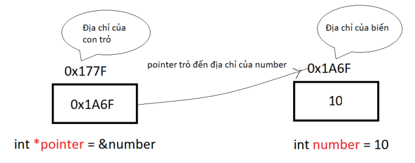
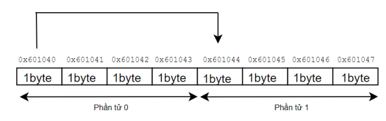
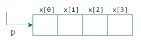
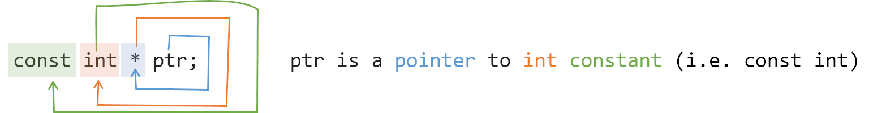
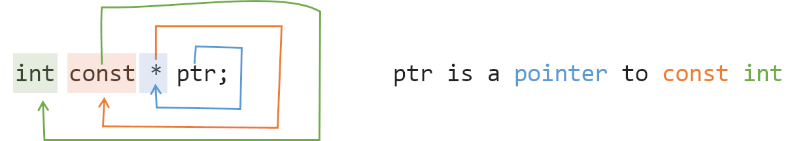
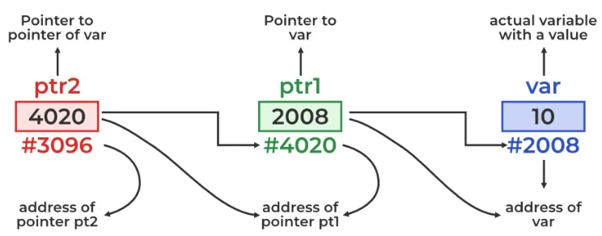
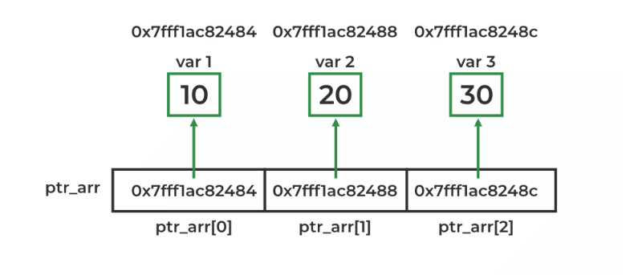
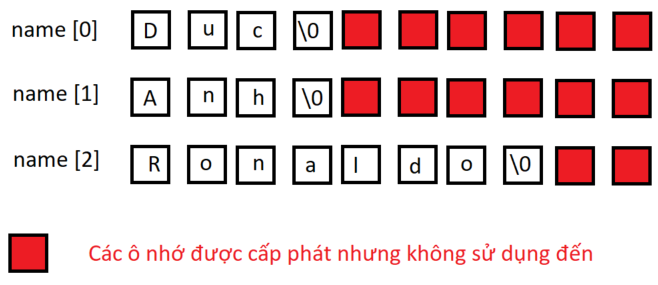
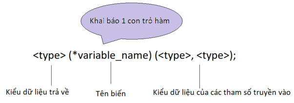

```python
Author: Lê Minh Đức (duc5.le)
Study time: 7/11/2023 - 8/11/2023
```

# Mục lục

1. [Con trỏ cấp 1 (Pointer)](#con_tro_cap_1)
   - [Lý thuyết chung con trỏ cấp 1 (Pointer)](#ly_thuyet_chung_con_tro_cap_1)
   - [Pointer and constant](#pointer_and_constant)
2. [Con trỏ cấp 2 (Pointer to pointer)](#con_tro_cap_2)
   - [Lý thuyết](#ly_thuyet)
   - [Coding](#Coding)
3. [Mảng con trỏ](#mang_con_tro)
   - [Ứng dụng](#ung_dung)
   - [Coding mảng con trỏ](#coding_mang_con_tro)
4. [Con trỏ hàm](#con_tro_ham)
   - [Lý thuyết con trỏ hàm](#ly_thuyet_con_tro_ham)
   - [Coding](#coding_con_tro_ham)

# <a id ="con_tro_cap_1"></a>Con trỏ cấp 1 (Pointer)

## <a id ="ly_thuyet_chung_con_tro_cap_1"></a>Lý thuyết chung con trỏ cấp 1 (Pointer)

Con trỏ trong C cũng là 1 biến bình thường, khác 1 chỗ là nó sẽ lưu trữ địa chỉ của 1 biến khác, tức là giá trị của chúng là 1 địa chỉ trong RAM.


```c
p: địa chỉ mà con trỏ p trỏ tới
*p: giá trị tại địa chỉ mà con trỏ p trỏ tới
&p: địa chỉ của con trỏ p
```

- Khai báo con trỏ
  `<kiểu dữ liệu> * <tên biến>`
- Kiểu con trỏ cần giống với kiểu biến mà nó trỏ tới
- Khi áp dụng toán tử tăng/giảm với con trỏ: nó sẽ di chuyển giữa các phẩn tử liền kề chứ không tăng giảm giá trị như biến thông thường.
  **Ví dụ**

```c
    #include "stdio.h"
    int number = 10;
    int main(){
        int *p = &number;
        printf("Địa chỉ hiện tại của p: %p\n", p);
        p = p + 1;
        printf("Địa chỉ mới của p: %p", p);
        return 0;
    }
```



- Mối quan hệ giữa _con trỏ_ và _mảng_
  Ta khai báo 1 con trỏ và 1 mảng 4 phần tử như sau:
  ```c
    int x[4];
    int *p;
    p = x;
    // gán con trỏ p trỏ đến địa chỉ của phần tử đầu tiên của mảng
    // hoặc có thể gán như sau p = &x[0], 2 cách gán này như nhau.
  ```
  
  Với mảng trong ảnh phía trên, ta có:
  ```c
  &x[0] và p có cùng giá trị, và x[0] hay _p hay p[0] là tương đương nhau.
  &x[1] tương đương với p+1 và x[1] tương đương với _(p+1) và p[1].
  &x[2] tương đương với p+2 và x[2] tương đương với _(p+2) và p[2].
  ```
  Tóm lại, **&x[i]** tương đương với **p+i** và **x[i]** tương đương với **\_(p+i)** và **p[i]**.

## <a id ="pointer_and_constant"></a>Pointer and constant

### Con trỏ hằng (pointer to constant)

Con trỏ hằng sẽ trỏ đến 1 vùng nhớ hằng (const), tại đây chỉ đọc được giá trị vùng nhớ chứ không thay đổi (write) được => **read-only** => đảm bảo nguyên vẹn các giá trị tại vùng nhớ mà nó trỏ tới

- Syntax
  `const <type> * variable_name`
- Ví dụ
  `const int * ptr`
  
  Ở ví dụ trên, con trỏ hằng _ptr_ được khai báo để trỏ tới 1 giá trị nguyên hằng. Điều này có nghĩa là giá trị mà _ptr_ trỏ tới ko thể thay đổi được, nhưng bạn có thể thay đổi vùng nhớ mà _ptr_ trỏ đến

### Hằng con trỏ

Hằng con trỏ chỉ có thể trỏ tới 1 vùng nhớ cố định, tức là không thay đổi địa chỉ trỏ tới nhưng nó có thể thay đổi được giá trị tại vùng nhớ chúng trỏ tới.

- Syntax
  `<type> int * const variable_name`

- Ví dụ:

  ```c
  #include <stdio.h>

  int main(){
    int q = 5;
    int *const ptr = &q;

    //Thay đổi "giá trị" tại vùng nhớ nó trỏ tới
    *ptr = 7;

    const int q2 = 7;

    //Complile lỗi vì không thay đổi được vùng nhớ mà nó trỏ tới
    ptr = &q2;

    return 0;
  }

  ```

  

### Hằng con trỏ hằng

Hằng con trỏ hằng sẽ bao gồm cả 2 tính chất kể trên, việc sử dụng nó sẽ cung cấp cho bạn 1 con trỏ chỉ trỏ đến được 1 địa chỉ và không thể thay đổi giá trị trỏ đến.

- Syntax
  `const <type> * const variable_name`

Thức tế rằng con trỏ hằng không nhất thiết phải trỏ đến vùng nhớ hằng, nó chỉ cần đảm bảo giá trị mà nó trỏ tới là không thể thay đổi.

- Ví dụ

  ```c
  #include <stdio.h>

  int main(){
    const int q = 5;
    //Valid
    const int* const p = &q;
    //Compilation error
    *p = 7;
    const int q2 = 7;
    //Compilation error
    p = &q2;
    return 0;
  }

  ```

# <a id ="con_tro_cap_2"></a>Con trỏ cấp 2 (Pointer to pointer)

## <a id ="ly_thuyet"></a>Lý thuyết

- Con trỏ cấp 2 là 1 con trỏ dùng để lưu trữ địa chỉ của 1 biến con trỏ khác
  

  Bản chất con trỏ cấp 2 cũng chỉ là con trỏ, chúng ta vẫn xuất được 3 giá trị liên quan tới con trỏ cấp 2 (giống như con trỏ cấp 1).

  ```c
  **ptr: giá trị mà ptr trỏ đến
  *ptr: địa chỉ của con trỏ mà ptr trỏ tới
  ptr: địa chỉ của **ptr
  ```

## <a id ="Coding"></a>Coding

- **Ví dụ 1:** tổng quát về con trỏ cấp 2

  ```c
  #include "stdio.h"

  int main() {
      int number = 100;
      int *ptr = &number;
      int **p_to_p = &ptr;

      printf("value of number = %d\n", number);
      printf("address of number = %p\n", &number);  // %p: hexadecimal
      printf("*\n");
      printf("value of ptr: %d\n", *ptr);
      printf("address of ptr: %p\n", &ptr);
      printf("address of number: %p\n", ptr);
      printf("*\n");
      printf("value of p_to_p: %d\n", **p_to_p);
      printf("address of p_to_p: %p\n", p_to_p);
      printf("address of ptr: %p\n", *p_to_p);  // the address that p_to_p points
      return 0;
  }
  ```

  **Output**

  ```c
  value of number = 10
  address of number = 0061FF18
  *
  value of ptr: 10
  address of ptr: 0061FF14
  address of number: 0061FF18
  *
  value of p_to_p: 10
  address of p_to_p: 0061FF14
  address of ptr: 0061FF18
  ```

  **Kết luận**

  ```c
  **p_to_p = *ptr = number
  p_to_p = &ptr
  *p_to_p = ptr = &number
  (bởi vì * kết hợp với & thành ko có ký hiệu gì cả)
  ```

- **Ví dụ 2:** sử dụng con trỏ cấp 2 để thay đổi địa chỉ trỏ đến của 1 con trỏ cấp 1

  ```c
  #include "stdio.h"

  int **changePointer(int *pointer);

  int number_a = 10;
  int number_b = 20;

  int *a = &number_a;
  int *b = &number_b;

  int main() {
      int **value = &a;
      printf("before value = %d\n", **value);
      value = changePointer(b);
      printf("after value = %d\n", **value);

      return 0;
  }

  int **changePointer(int *pointer) {
      int **p_to_p = &pointer;
      return p_to_p;
  }
  ```

- **Ví dụ 3:** sử dụng con trỏ cấp 2 để cấp phát động cho con trỏ cấp 1

  ```c
  void allocateMemory(int **p_to_p, int sizeAllocate) {
      // *p_to_p = (int *)malloc(sizeAllocate * sizeof(int));
      *p_to_p = (int *)calloc(sizeAllocate, sizeof(int));  // allocate memory for address that p_to_p points to
      if (*p_to_p == NULL) {
          printf("Memory equals null\n");
      }
  }
  ```

- **Ví dụ 4:** sử dụng con trỏ cấp 2 để cấp phát động cho "array pointer" (mảng con trỏ)
  Để biết _mảng con trỏ_ là gì, bạn có thể đọc mục bên dưới.

  ```c
    int **p_to_t = (int **)calloc(5, sizeof(int *));
  ```

- **Ví dụ 5:** sử dụng con trỏ cấp 2 để cấp phát động cho mảng 2 chiều

  ```c
  #include "stdio.h"
  #include "stdlib.h"

  int number = 0;

  int main() {
      int **p_to_p = NULL;
      int col = 3, row = 4;
      p_to_p = (int **)malloc(row * sizeof(int *));
      // Cấp phát bộ nhớ cho từng con trỏ cấp 1
      for (int i = 0; i < row; i++) {
          p_to_p[i] = (int *)calloc(col, sizeof(int));
      }
      // Gán giá trị vào mảng 2 chiều
      for (int i = 0; i < row; i++) {
          for (int j = 0; j < col; j++) {
              p_to_p[i][j] = number;
              number++;
          }
      }
      // In mảng 2 chiều
      for (int i = 0; i < row; i++) {
          for (int j = 0; j < col; j++) {
              printf("%d\t", p_to_p[i][j]);
          }
          printf("\n");
      }

      for (int i = 0; i < row; i++) {  // giải phóng bộ nhớ cho từng hàng
          free(p_to_p[i]);
      }
      free(p_to_p);  // giải phóng bộ nhớ của double pointer
      return 0;
  }
  ```

# <a id ="mang_con_tro"></a>Mảng con trỏ

Mảng con trỏ trong C là một mảng các con trỏ. Mỗi phần tử trong mảng là 1 con trỏ, mỗi con trỏ sẽ trỏ đến 1 đối tượng hoặc 1 vùng nhớ khác.

## <a id ="ung_dung"></a>Ứng dụng

- Sử dụng để lưu trữ multiple strings
- Sử dụng để implement LinkedHashMap & thuật toán sorting: bucket sort
- Sử dụng để lưu trữ nhiều kiểu pointer được khai báo riêng biệt

  [Tham khảo thêm tại đây](https://www.geeksforgeeks.org/array-of-pointers-in-c/)

## <a id ="coding_mang_con_tro"></a>Coding mảng con trỏ

- **Ví dụ 1:** tổng quát về mảng con trỏ

  ```c

  #include <stdio.h>

  int main() {
  int var1 = 10;
  int var2 = 20;
  int var3 = 30;
  // array of pointers to integers
  int* ptr_arr[3] = {&var1, &var2, &var3};
  // traversing using loop
  for (int i = 0; i < 3; i++) {
      printf("Value of var %d: %d\tAddress: %p\n", i + 1, *ptr_arr[i], ptr_arr[i]);
  }
  return 0;
  }
  ```



- **Ví dụ 2:** sử dụng mảng con trỏ thay vì sử dụng dụng mảng 2 chiều
  Để lưu giá trị nhiều _string_ trong 1 _array_, trước đấy sử dụng mảng 2 chiều để lưu, như sau:

  `char name[3][10] = { "Duc", "Anh", "Ronaldo" };`

  _Việc khai báo như trên sẽ dẫn đến lãng phí bộ nhớ_
  

  _Vì thế ta sử dụng mảng con trỏ để lưu trữ các string đấy_

  ```c

  int main() {
  char \*name[] = {
  "Duc",
  "Anh",
  "Ronaldo"};

        for (int i = 0; i < 3; i++) {
            printf("%s \n", name[i]);
        }
        return 0;

  }

  ```

- **Ví dụ 3:** sử dụng mảng con trỏ để lưu các hàm có cùng kiểu trả về

  ```c

  #include "stdio.h"

  int sayHello() {
    printf("sayHello\n");
    }
    int sayBye(int a) { //Khác tham số truyền vào nhưng không truyền vào thì vẫn run ok
    printf("sayBye\n");
    }
    int sayGoodJob() {
    printf("sayGoodJob\n");
    }

    int main() {
    int a = 10, b = 20;
    int (\*arrayPointer[3])() = {sayHello, sayBye, sayGoodJob};
    for (int i = 0; i < 3; i++) {
    arrayPointer[i]();
    }
  return 0;
  }

  ```

# <a id ="con_tro_ham"></a>Con trỏ hàm

## <a id ="ly_thuyet_con_tro_ham"></a>Lý thuyết con trỏ hàm

- Khi 1 hàm được định nghĩa và khi chương trình run, trên RAM sẽ có 1 địa chỉ cấp phát cho hàm này, từ đấy 1 con trỏ sẽ _trỏ_ tới địa chỉ này, vì thế ta có **con trỏ hàm**
- Con trỏ hàm là 1 biến lưu trữ địa chỉ của 1 hàm, thông qua biến đó để gọi hàm mà nó trỏ tới thay vì phải gọi cả tên hàm. Vì thế **con trỏ hàm** sẽ giúp chúng ta viết những đoạn code mang tính tổng quát hay viết những hàm _callback_ trong chương trình.
- Syntax
  `int (*fun)(int,int); //khai báo tường minh`
  hoặc
  `typedef int(*fun)(int,int); //khai báo không tường minh`
  

## <a id ="coding_con_tro_ham"></a>Coding

- **Ví dụ 1:** khai báo tường minh

  ```c
  #include <stdio.h>

  int calSum(int x, int y) {
      return x + y;
  }

  int main(int n, char** args) {
      int (*funPointer)(int, int);
      funPointer = calSum;
      int result = funPointer(10, 20);
      printf("Value = %d\n", result);
  }
  ```

- **Ví dụ 2:** khai báo không tường minh

  ```c
  #include <stdio.h>

  typedef int (*funPointer)(int, int);

  int calSum(int x, int y) {
      return x + y;
  }

  int main(int n, char** args) {
      funPointer fun_ptr = calSum;
      int result = fun_ptr(10, 20);
      printf("Value = %d\n", result);
  }
  ```

- **Ví dụ 3:** sử dụng con trỏ hàm làm tham số của 1 hàm

  ```c
  #include <stdio.h>

  int calculateSum(int a, int b) {
      return a + b;
  }
  int calculateMinus(int a, int b) {
      return a - b;
  }
  int calculateTimes(int a, int b) {
      return a * b;
  }
  typedef int (*funPointer)(int, int);
  int callFunction(int a, int b, funPointer calculateFunc) {
      return calculateFunc(a, b);
  }
  int main(int n, char** args) {
      int result = callFunction(10, 20, calculateMinus);
      printf("Value = %d\n", result);
  }
  ```
